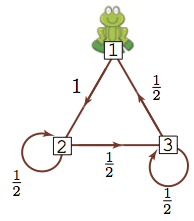

## Monte Carlo methods: Markov Chains

```{r setup, echo = FALSE, message = FALSE}
library(knitr)
opts_chunk$set(fig.cap="",
               fig.path="lecture-24-fig/",
               fig.width=6, fig.height=4, dpi=150,
               warning = FALSE)
set.seed(1)
```


Today: Markov Chains

Our goals:

- Building towards Markov chain monte carlo

- We will eventually use Markov chains to get samples from arbitrary probability distributions

- Today we will just look at Markov chains, define them, establish some of their properties

Reading: [Notes from Richard Weber's course on Markov chains](http://www.statslab.cam.ac.uk/~rrw1/markov/M.pdf), or Lange, Chapter 23.

- Weber's notes have proofs and examples, and much more detail than we'll use here. I'm following his notation.

- Lange Chapter 23 is quite succinct.

-----

## A silly example



A frog hops around on some lily pads, choosing where to hop somewhat randomly.

We would like to be able to make probability statements about where the frog is.

- After $n$ hops, what is the probability that the frog is on the 3rd lily pad?

- As $n \to \infty$, what is the probability that the frog is on the 3rd lily pad? Does the starting location of the frog matter?

## Definitions

. . .

- Let $I$ be a countable set, $\{ i, j, k, \ldots \}$.

- Each $i \in I$ is called a _state_ and $I$ is the _state space_.

- Let $\lambda = (\lambda_i, i \in I)$ be a row vector with $i$th element $\lambda_i$ such that $\sum_{i} \lambda_i = 1$. $\lambda$ defines the _initial distribution_ over $I$.

- Let $P = (p_{ij}: i,j \in I)$ with $p_{ij} \ge 0$ for all $i,j$ and such that $\sum_{j \in I} p_{ij} = 1$. $P$ is a transition probability matrix.

- A sequence of random variables, $(X_n)_{n \ge 0}$ is a _Markov chain_ with initial distribution $\lambda$ and transition matrix $P$ if for all $n \ge 0$, and all $i \in I$:

- $P(X_0 = i) = \lambda_i$

- $P(X_{n+1}= i_{n+1}\mid X_0 = i_0, \ldots, X_n = i_n) = P(X_{n+1} = i_{n+1} \mid X_{n} = i_n) = p_{i_n, i_{n+1}}$


## A silly example


A frog hops around on some lily pads, choosing where to hop somewhat randomly.

- State space: $I = \{1,2,3\}$ (the three lily pads)

- Starting distribution $\lambda = (1, 0,0)$ (starts on lily pad 1)

- Transition matrix: $P = \begin{pmatrix} 0 & 1 & 0 \\ 0 & .5 & .5 \\ .5 & 0 & .5 \end{pmatrix}$

## n-step transition matrix

Given a starting distribution $\lambda$, we would like to know $P(X_n = j)$.

We will use the notation $P_i(A) = P(A \mid X_0 = i)$ for $A$ any event.

. . .

For $n = 1$, we know that
$$
P(X_1 = j) = \sum_{i \in I} \lambda_i P_i(X_1 = j) = \sum_{i \in I} \lambda_i p_{ij} = (\lambda P)_j
$$

. . .

For $n = 2$, we can write
$$
P_i(X_2 = j) = \sum_k P_i(X_1 = k, X_2 = j) = \sum_k p_{ik} p_{kj} = (P^2)_{ij}
$$

. . .

$$
P(X_2 = j) = \sum_{i,k} \lambda_i P_i(X_1 = k, X_2 = j) = \sum_{i,k} \lambda_i p_{ik} p_{kj} = (\lambda P^2)_j
$$

. . .

So in general, if $\delta_i$ is the vector with a 1 at index $i$ and 0's everywhere else,
$$
P_i(X_n = j) = (\delta_i P^n)_j = (P^n)_{ij}
$$
and
$$
P(X_n = j) = \sum_i \lambda_i P_i(X_n = j) = (\lambda P^n)_j
$$

. . .

So the $n$-step transition matrix is simply $P^n$.

## Example of n-step transition matrix computations


```{r}
P = matrix(0, nrow = 3, ncol = 3)
P[1,2] = 1
P[2,2] = P[2,3] = P[3,1] = P[3,3] = 1/2
P
```

. . .

```{r}
lambda = c(1,0,0)
lambda %*% P
lambda %*% P %*% P
```

-----


What happens after a long time?

. . .

```{r}
## computes P^(2^k)
pow_P = function(P, k) {
    for(i in 1:k) {
        P = P %*% P
    }
    return(P)
}
## 8-step probabilities 
lambda %*% pow_P(P, 3)
## 16-step probabilities 
lambda %*% pow_P(P, 4)
## 32-step probabilities 
lambda %*% pow_P(P, 5)
## 64-step probabilities 
lambda %*% pow_P(P, 6)
```

-----

What if the frog starts at a different location?

. . .

```{r}
## 2^6-step probabilities, starting at 2
lambda = c(0,1,0)
lambda %*% pow_P(P, 6)
## 2^6-step probabilities, starting at 3
lambda = c(0,0,1)
lambda %*% pow_P(P, 6)
```


-----

In this case, no matter where the frog starts, we get the same probabilities:

```{r}
pow_P(P, 6)
```


## Another example


```{r}
P_big = matrix(0, nrow = 7, ncol = 7)
P_big[1:3,1:3] = P
P_big[4,3:5] = c(.25, .5, .25)
P_big[5, 6:7] = c(.5, .5)
P_big[6,4] = 1
P_big[7,7] = 1
P_big
```

-------

. . .

Let's do the same thing: if we start the frog at different locations, compute the probability of being at any of the lily pads after 64 steps.

```{r}
## 2^6-step probabilities, starting at 1
lambda = c(1, rep(0, 6))
lambda %*% pow_P(P_big, 6)
## 2^6-step probabilities, starting at 7
lambda = c(rep(0, 6), 1)
lambda %*% pow_P(P_big, 6)
## 2^6-step probabilities, starting at 6
lambda = c(rep(0, 5), 1, 0)
lambda %*% pow_P(P_big, 6)
round(pow_P(P_big, 6), digits = 2)
```

-----

Our next goal is to find the conditions under which this convergence occurs.

We'll need two concepts:

- Communicating classes/irreducibility

- Invariant distributions

## Class structure

We say state $i$ leads to $j$, $i \to j$ if
$$
P_i(X_n = j \text{ for some } n \ge 0) > 0
$$

. . .

We say that $i$ communicates with $j$ and write $i \leftrightarrow j$ if $i \to j$ and $j \to i$.


## Communicating classes

From what we saw before, we can see that

- $i \leftrightarrow j$ and $j \leftrightarrow k$ implies $i \leftrightarrow k$

If we add that $i \leftrightarrow i$, $\leftrightarrow$ satisfies the conditions for an [equivalence relation](https://en.wikipedia.org/wiki/Equivalence_relation).

We use $\leftrightarrow$ to partition the state space $I$ into communicating clases.

. . .


## Irreducibility

We will want Markov chains that are _irreducible_.

A chain with transition matrix $P$ is _irreducible_ if the state space $I$ forms a single class.

. . .

Is the little frog Markov chain irreducible?


## Invariant distributions

Definition:

- Let $\lambda \in \mathbb R^n$  be a row vector such that $\sum_i \lambda_i = 1$.

- $\lambda$ is an invariant distribution if $\lambda P = \lambda$.

. . .

Interpretation:

- If we start a chain by choosing $X_0$ with probabilities as given in $\lambda$, $P(X_n = i) = \lambda_i$ for any $n, i$.


## Convergence of chains to equilibrium

(Theorem 9.8 in the linked notes)

Let $P$ be irreducible, positive recurrent, and aperiodic (we haven't defined positive recurrent or aperiodic here, but you can look in the notes), with invariant distribution $\pi$.

Then for any initial distribution, $P(X_n = j) \to \pi_j$ as $n \to \infty$.

. . .

Interpretation: No matter where we start, the chain converges to a unique distribution.

- We saw in the 3-lily-pad frog example that we got this convergence to an equilibrium distribution.

- In the 7-lily-pad example, the starting position of the frog mattered.

## Ergodic theorem

Let $(X_n)_{0 \le n \le N}$ be a Markov chain with transition matrix $P$.

If $P$ is irreducible and positive recurrent, then for any bounded function $f$ we have
$$
P(\frac{1}{n} \sum_{k=1}^n f(X_k) \to \bar f \text{ as } n \to \infty) = 1
$$
where
$$
\bar f = \sum_{x} \pi_i f(i)
$$
and $\pi$ is the unique invariant distribution.


. . .

Why is this useful?

- We can use this like we use the law of large numbers.

- If we want to compute $E_{X \sim \pi}[(f(X))]$, we can run a Markov chain with invariant distribution $\pi$ and use $\frac{1}{n} \sum_{i=1}^n f(X_i)$ as an estimate.

## Looking forward

Now we know:

- Markov chains, under certain conditions, have invariant distributions.

- If we have a Markov chain and know its invariant distribution, we can use it to approximate expected values of random variables taken from that distribution.

Next time:

- Given a target distribution (usually a posterior), we will construct a Markov chain that has that target distribution as the invariant distribution.

- The Markov chain won't give us independent samples from the distribution, but it will allow us to approximate expected values of functions under that distribution.


. . .

By the way:

- This semester we're just using Markov chains to sample from probability distributions, but they are interesting models in their own right

- The frog example seems silly, but it's actually the model behind the initial version of google's web page indexing algorithm. Lily pads are websites, connections between lily pads are links between websites. See the linked notes for a little more detail.
