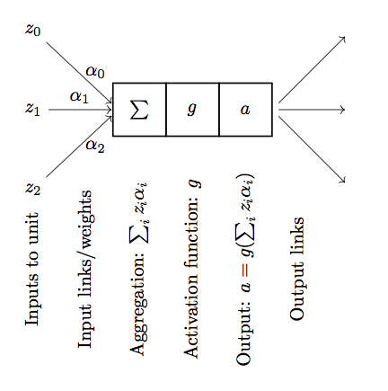
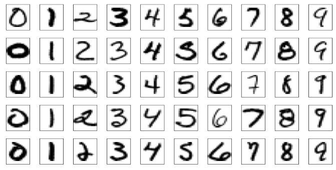

## Neural nets/Deep learning

```{r setup, echo = FALSE, message = FALSE}
library(knitr)
opts_chunk$set(fig.cap="",
               fig.path="lecture-27-fig/",
               fig.width=3, fig.height=2, dpi=70,
               warning = FALSE)
set.seed(1)
```


> - Today: What are neural nets, how are they fit

> - Thursday: Cross validation, some examples, show you how to use R interfaces to net fitting software

Reading: Elements of Statistical Learning, Chapter 11.3-11.8

## Review: The brain

> - Made up of neurons.

> - Neurons connected to each other.

> - Neuron takes input from some of its neighbors, when there is enough input it is "activated" and the neuron fires.

> - When the neuron fires, it sends the signal to its downstream neighbors, potentially causing them to activate and fire as well.


[wikipedia's illustration](https://en.wikipedia.org/wiki/Neuron#/media/File:Chemical_synapse_schema_cropped.jpg)

-------

Idea:

> - The brain somehow takes inputs and produces outputs (e.g. patterns of light on the retina to a classification of the objects in your field of vision, sensations in the periphery to a measure of temperature, etc.).

> - If we make a computational structure that mimics the brain, we can train it to make predictions from arbitrary sets of inputs.

> - This is just a fancy version of the regression or classification problem.

## Neural networks

Neural networks are made up of units that are supposed to mimic neurons in the brain:



- Input links: can be from other units or from the input data

- Aggregation function: Linear combination of the inputs

- Activation function: $g$, often the sigmoid function

- Output: $a = g(\sum_i z_i \alpha_i)$, i.e., the activation function applied to the aggregated inputs.

- Output links: Output $a$ is sent to other units.

-----

Activation functions:

. . .

- Initially: a step function

```{r echo = FALSE}
x = seq(-5, 5, length.out = 1000)
y = (x >= 0) + 0
ggplot(data.frame(x, y)) + geom_line(aes(x = x , y = y))
```

. . .

- sigmoid, $\sigma(x) = \frac{1}{1 + \exp(-x)}$

```{r echo = FALSE}
y = 1 / (1 + exp(-x))
ggplot(data.frame(x, y)) + geom_line(aes(x = x , y = y))
```

. . .

- tanh: $\text{tanh}(x) = \frac{e^x - e^{-x}}{e^x + e^{-x}}$

```{r echo = FALSE}
y = tanh(x)
ggplot(data.frame(x, y)) + geom_line(aes(x = x , y = y))
```

. . .

- relu: $\text{relu}(x) = \text{max}(0, x)$ probably most common now.

```{r echo = FALSE}
y = sapply(x, max, 0)
ggplot(data.frame(x, y)) + geom_line(aes(x = x , y = y))
```


Any non-linear activation function allows the net to go beyond linear functions of the input

Activation functions should be smooth for fitting purposes (gradient descent)

-----

Neural net structures: putting the units together


> - Input layer

> - Hidden layer(s)

> - Output layer

. . .

Multiple hidden layers vs. one hidden layer

Special cases:

> - One hidden layer, one unit in that layer, sigmoid activation = logistic regression

> - Linear activation function = standard regression, parameterized in a strange way


## Neural nets for regression

Notice that the net is just a fancy function of the inputs, parameterized by the weights. Therefore, we can choose the weights so that the net predicts a response, just like in standard linear regression.

- Function we want to optimize:
$$
R(\theta) = \sum_{i=1}^N R_i = \sum_{i=1}^N (y_i - f(x_i; \theta))^2
$$

- $\theta$ is the parameter vector we want to optimize over, containing the weights. We want to find $\theta$ that minimizes $R(\theta)$.

- $f(x_i; \theta)$ is the value computed by the net on an input point $x_i$ with parameters $\theta$

- Fitting is by "backpropagation", which means gradient descent with the computations organized in a particularly convenient way.

-----

## Backpropagation derivation

Simple case:

- One hidden layer with $M$ hidden units

- Input variables $x_i \in \mathbb R^p$, $i = 1,\ldots, N$

- Values of the hidden unit $m$ for observation $i$ is $z_{mi} = \sigma(\alpha_{0m} + \alpha_m^T x_i)$. The vector containing the values for all the hidden units for sample $i$ is $z_i = (z_{1i}, z_{2i}, \ldots, z_{Mi})$.

- Value at the final layer is for observation $i$ is $f(x_i) = g(\beta_0 + \beta^T z_i)$.

- $\theta$ is the set of weights $\alpha_{0m}, \alpha_m, \beta_0, \beta$.

- We want to find $\theta$ to minimize
$$
R(\theta) = \sum_{i=1}^N R_i = \sum_{i=1}^N (y_i - f(x_i; \theta))^2
$$

- We fit by gradient descent, so we need dereivatives of this function

-----

Derivative for the weights connecting the hidden layer to the output layer for $m = 1,\ldots, M$:
$$
\frac{\partial R_i}{\partial \beta_{m}} = -2(y_i - f(x_i)) g'(\beta_0 + \beta^T z_i) z_{mi}
$$

. . .

For the case $m = 0$:
$$
\frac{\partial R_i}{\partial \beta_{m}} = -2(y_i - f(x_i)) g'(\beta_0 + \beta^T z_i)
$$


. . .

Derivative for the weights connecting the input layer to the hidden layer:
$$
\frac{\partial R_i}{\partial \alpha_{ml}} = -2(y_i - f(x_i)) g'(\beta_0 + \beta^T z_i) \beta_m\sigma'(\alpha_m^T x_i) x_{il}
$$

. . .

Gradient descent update is then:
$$
\begin{align*}
\beta_m^{(r+1)} = \beta_{m}^{(r)} - \gamma_r \sum_{i=1}^N \frac{\partial R_i}{\partial \beta_{m}^{(r)}}\\
\alpha_{lm}^{(r+1)} = \alpha_{ml}^{(r)} - \gamma_r \sum_{i=1}^N \frac{\partial R_i}{\partial \alpha_{ml}^{(r)}}
\end{align*}
$$

$\gamma_r$ is referred to as the "learning rate", we've seen it as the step size before.

-----

Back-propagation equations, aka "what order do we do the computations in"?

. . .

Write
$$
\begin{align*}
\frac{\partial R_i}{\partial \beta_{m}} &= \delta_{i} z_{mi} \\
\frac{\partial R_i}{\partial \alpha_{ml}} &= s_{mi} x_{il}
\end{align*}
$$
so
$$
\begin{align*}
\delta_i &= -2(y_i - f(x_i))g'(\beta_0 + \beta^T z_i) \\
s_{mi} &= -2(y_i - f(x_i)) g'(\beta_0 + \beta^T z_i) \beta_m \sigma'(\alpha_m^T x_i)
\end{align*}
$$
and
$$
s_{mi} = \sigma'(\alpha_m^T x_i) \beta_m \delta_i
$$

Interpretation: $\delta_i$ and $s_{mi}$ are the "errors" from the current model on the output layer and the hidden layers, respectively.

-----

Finally, backpropagation algorithm to compute the gradients:

Forward pass:

> - Fix a set of weights $\theta$

> - Compute $z_i$, $f(x_i)$ given the weights

. . .

Backward pass:

> - Compute $\delta_i$ and $\frac{\partial R_i}{\partial \beta_m}$ from the residuals

> - Compute $s_{mi}$ and $\frac{\partial R_i}{\partial \alpha_{ml}}$ from $\delta_i$, $\theta$, input values

-----

Notes:

> - Backpropagation equations just rely on the chain rule

> - Can use any smooth activation function

> - Can use any architecture (more hidden layers, different kinds of connections between the layers, more than one output layer, etc.)

> - Applies to classification problems as well as regression problems

. . .

Issues with fitting:

> - Model is over-parameterized

> - Non-convex, many local optima, gradient descent will converge to just one

> - Many different strategies to deal with this. Often don't actually want even an exact local optimum, many different "regularization" methods are used.


## Example: zip code data



Goal: Given images representing digits, classify them correctly.

Input data, $x_i$, are $16 \times 16$ grayscale images, represented as vectors in $\mathbb R^{256}$

Responses $y_i$ give the digit in the image.

Encode this as a classification problem, use neural nets with different architectures to fit

-----

## Some net architectures


All cases: 10 output units, corresponding to the 10 possible digits. In all cases the output unit is sigmoidal.

- Net 1: No hidden layer, equivalent to multinomial logistic regression

- Net 2: One hidden layer, 12 hidden units. Each of the hidden units is connected to each of the 256 input variables and to each of the 10 output variables.

- Net 3: Two hidden layers

    - First hidden layer: 64 hidden units arranged in an 8 x 8 grid. Each hidden unit is connected to a 3x3 patch of the input variables.

    - Secand hidden layer: 16 hidden units arranged in a 4 x 4 grid. Each hidden unit is connected to a 5 x 5 patch in the first hidden layer.

- Net 4: Two hidden layers with weight sharing in the first layer.

    - First hidden layer: 128 hidden units, conceptualized as two 8 x 8 grids, each connected to a 3x3 patch of the input variables, similar to Net 3. Additional constraint that each of the units within the 8 x 8 feature map have the same set of 9 weights.

    - Second hidden layer: 16 hidden units arranged in a 4 x 4 grid, each connected to a 5 x 5 patch in each of the two 8 x 8 grids in the first hidden layer (so each hidden unit connected to 50 units in the first hidden layer).

- Net 5: Two hidden layers with weight sharing in both layers:

    - First hidden layer: Same is in Net 4.

    - Second hidden layer: 64 hidden units arranged as four 4 x 4 grids. Each unit connected to a 5 x 5 patch of the fisrt hidden layer, and within each 4 x 4 grid, the weights connecting that unit to the previous input unit are the same.


Idea behind weight constraints: Each unit computes the same functional of the previous layer, so they are extracting the same features from different parts of the image. A net with this sort of weight sharing is referred to as a _convolutional_ network.

-----


-----

## Summing up


> - Deep learning = neural nets with more than one hidden layer. In practice, these work better than the single-hidden-layer networks.

> - Think of as predictors that can fit complex functions of the input variables

> - Also able to handle other kinds of output, e.g. sequences (natural language processing, machine translation)

> - Good when you have a lot of data, are interested solely in prediction

> - Not as good when you don't have so much data or need an interpretation of the relationship between the predictors and response.
