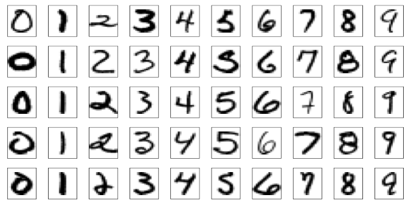
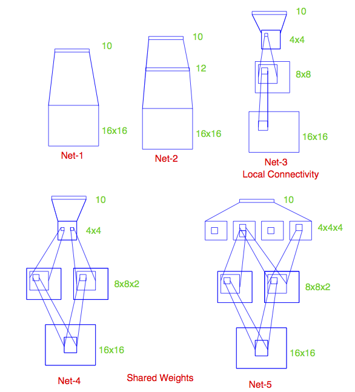
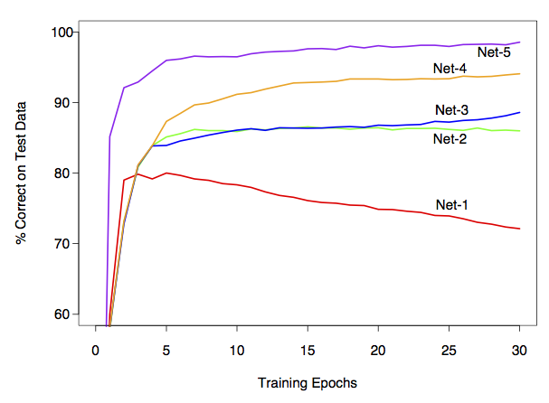

## Neural nets/Deep learning

```{r setup, echo = FALSE, message = FALSE}
library(knitr)
opts_chunk$set(fig.cap="",
               fig.path="lecture-28-fig/",
               fig.width=6, fig.height=7, dpi=70,
               warning = FALSE)
set.seed(1)
```

Agenda today:

> - More nets

> - Cross validation

Reading: Elements of Statistical Learning, Chapter 11.3-11.8


## Example: zip code data



Goal: Given images representing digits, classify them correctly.

Input data, $x_i$, are $16 \times 16$ grayscale images, represented as vectors in $\mathbb R^{256}$

Responses $y_i$ give the digit in the image.

Encode this as a classification problem, use neural nets with different architectures to fit

-----

## Some net architectures



All cases: 10 output units, corresponding to the 10 possible digits. In all cases the output unit is sigmoidal.

- Net 1: No hidden layer, equivalent to multinomial logistic regression

- Net 2: One hidden layer, 12 hidden units. Each of the hidden units is connected to each of the 256 input variables and to each of the 10 output variables.

- Net 3: Two hidden layers

    > - First hidden layer: 64 hidden units arranged in an 8 x 8 grid. Each hidden unit is connected to a 3x3 patch of the input variables.

    > - Secand hidden layer: 16 hidden units arranged in a 4 x 4 grid. Each hidden unit is connected to a 5 x 5 patch in the first hidden layer.

- Net 4: Two hidden layers with weight sharing in the first layer.

    > - First hidden layer: 128 hidden units, conceptualized as two 8 x 8 grids, each connected to a 3x3 patch of the input variables, similar to Net 3. Additional constraint that each of the units within the 8 x 8 feature map have the same set of 9 weights.

    > - Second hidden layer: 16 hidden units arranged in a 4 x 4 grid, each connected to a 5 x 5 patch in each of the two 8 x 8 grids in the first hidden layer (so each hidden unit connected to 50 units in the first hidden layer).

- Net 5: Two hidden layers with weight sharing in both layers:

    > - First hidden layer: Same is in Net 4.

    > - Second hidden layer: 64 hidden units arranged as four 4 x 4 grids. Each unit connected to a 5 x 5 patch of the fisrt hidden layer, and within each 4 x 4 grid, the weights connecting that unit to the previous input unit are the same.


Idea behind weight constraints: Each unit computes the same functional of the previous layer, so they are extracting the same features from different parts of the image. A net with this sort of weight sharing is referred to as a _convolutional_ network.

-----



## If you want to play with this in R

> - R package called [keras](https://keras.rstudio.com/)

> - This is an interface to the python version of [keras](https://keras.io/)

> - Which is itself a frontend for a couple of lower-level packages (TensorFlow, CNTK, Theano)

-----

Example: the same zip code data

```{r}
## if you want to do this you'll have to install some the python version of keras first, which requires you to have TensorFlow, CNTK, or Theano installed as well
library(keras)
mnist = dataset_mnist()
img_rows = img_cols = 28
num_classes = 10
x_train = mnist$train$x
x_train = array_reshape(x_train, c(nrow(x_train), img_rows, img_cols, 1))
y_train = mnist$train$y
y_train_matrix = to_categorical(y_train, num_classes = num_classes)
x_test = mnist$test$x
y_test = mnist$test$y
```

-----

Let's look at some of the images:

```{r}
## function to rearrange things so that we can plot them
flip_image = function(x) {
    n = nrow(x)
    return(t(x[n:1,]))
}
par(mfrow = c(3,3))
for(i in 1:9) {
    image(flip_image(x_train[i,,,]), col = topo.colors(100), axes = FALSE,
          main = y_train[i])
}

```

-----

```{r}
model = keras_model_sequential()
model %>%
  layer_flatten(input_shape = c(img_rows, img_cols)) %>%
  layer_dense(units = 128, activation = 'relu') %>%
  layer_dense(units = num_classes, activation = 'softmax')
model %>% compile(
    optimizer = 'adam', 
    loss = loss_categorical_crossentropy,
    metrics = 'accuracy'
)
model
## number of parameters for the first layer: each hidden unit has a weight associated with each of the 784 predictor units, plus a bias term
(784 + 1) * 128
## number of parameters for the second layer: each output unit has a weight associated with each of the 128 hidden units, plus a bias term
(128 + 1)* 10
```

-----

Fit the model, look at the predictions:

```{r}
model %>% fit(x = x_train, y = y_train_matrix, epochs = 15)
test_predictions = model %>% predict_classes(x_test)
par(mfrow = c(3,3))
for(i in 1:9) {
    image(flip_image(x_test[i,,]), col = topo.colors(100), axes = FALSE,
          main = sprintf("True digit: %i, Prediction: %i", y_test[i], test_predictions[i]))
}
```

-----

More elaborate architectures do much better, for example the [convolutional model](https://keras.rstudio.com/articles/examples/mnist_cnn.html).

```{r, eval = FALSE}
model_conv <- keras_model_sequential() %>%
    layer_conv_2d(filters = 32, kernel_size = c(3,3), activation = 'relu',
                  input_shape = c(img_rows,img_cols,1)) %>%
    layer_conv_2d(filters = 64, kernel_size = c(3,3), activation = 'relu') %>%
    layer_max_pooling_2d(pool_size = c(2, 2)) %>%
    layer_dropout(rate = 0.25) %>%
    layer_flatten() %>%
    layer_dense(units = 128, activation = 'relu') %>%
    layer_dropout(rate = 0.5) %>%
    layer_dense(units = num_classes, activation = 'softmax')
model_conv %>% compile(
  loss = loss_categorical_crossentropy,
  optimizer = 'adam',
  metrics = c('accuracy')
  )
model_conv
model_conv %>% fit(x = x_train, y = y_train_matrix, epochs = 15)
```


## Part 2: Cross validation

We have:

> - Data $X_1, \ldots, X_n$.

> - A set of models for the data.

> - A function $L$ that takes a fitted model and a data point and returns a measure of model quality.

We would like to choose one model from the set of candidate models.


## Example: Neural nets

> - Data: Pairs of predictors and response variables, $(y_i, X_i)$, $i = 1,\ldots, n$, $y_i \in \mathbb R$, $X_i \in \mathbb R^p$

> - Models: The two models we defined in the first half of lecture.

> - Model quality: Squared-error loss. If $\hat f_1$ and $\hat f_2$ are the functions corresponding to the fitted neural nets, model quality is measured by
$$
L(\hat \beta_\theta, (y_i, X_i)) = (y_i - \hat f_\theta(X_i))^2, \quad \theta = 1,2
$$

We want to decide whether the first or the second neural net is better at explaining the response.

. . .

Naive solution: Find the model that has the lowest value for the squared-error loss.


## Example: Regression

> - Data: Pairs of predictors and response variables, $(y_i, X_i)$, $i = 1,\ldots, n$, $y_i \in \mathbb R$, $X_i \in \mathbb R^p$

> - Models: $y_i = X \beta + \epsilon$, $\beta_j = 0, j \in S_\theta$, where $S_\theta \subseteq \{1,\ldots, p\}$.

> - Model quality: Squared-error loss. If $\hat \beta_\theta$ are our estimates of the regression coefficients in model $\theta$, model quality is measured by
$$
L(\hat \beta_\theta, (y_i, X_i)) = (y_i - X_i^T \hat \beta_\theta)^2
$$

We want to choose a subset of the predictors that do the best job of explaining the response.

. . .

Naive solution: Find the model that has the lowest value for the squared-error loss.

Why doesn't this work?

## Example: Mixture models

> - Data: $x_1,\ldots, x_n$, $x_i \in \mathbb R$

> - Models: Gaussian mixture models with $\theta$ mixture components.

> - Model quality: Log likelihood of the data. If $\hat p_\theta$ is the density of the fitted model with $\theta$ components, model quality is measured by $L(\hat p_\theta, x_i) = \log \hat p_\theta(x_i)$.

We want to choose the number of mixture components that best explains the data.

. . .

Naive solution: Choose the number of mixture components that maximizes the log likelihood of the data.


## Better Solution: Cross validation

Idea: Instead of measuring model quality on the same data we used to fit the model, we estimate model quality on new data.

If we knew the true distribution of the data, we could simulate new data and use a Monte Carlo estimate based on the simulations.

We can't actually get new data, and so we hold some back when we fit the model and then pretend that the held back data is new data.

-----

Procedure:

> - Divide the data into $K$ folds

> - Let $X^{(k)}$ denote the data in fold $k$, and let $X^{(-k)}$ denote the data in all the folds except for $k$.

> - For each fold and each value of the tuning parameter $\theta$, fit the model on $X^{(-k)}$ to get $\hat f_\theta^{(k)}$

> - Compute
$$
\text{CV}(\theta) = \frac{1}{n} \sum_{k=1}^K \sum_{x \in X^{(k)}} L(\hat f_\theta^{(k)}, x)
$$

> - Choose $\hat \theta = \text{argmin}_{\theta} \text{CV}(\theta)$

## Example

```{r}
n = 100
p = 20
X = matrix(rnorm(n * p), nrow = n)
y = rnorm(n)
get_rss_submodels = function(n_predictors, y, X) {
    if(n_predictors == 0) {
        lm_submodel = lm(y ~ 0)
    } else {
        lm_submodel = lm(y ~ 0 + X[,1:n_predictors, drop = FALSE])
    }
    return(sum(residuals(lm_submodel)^2))
}
p_vec = 0:p
rss = sapply(p_vec, get_rss_submodels, y, X)
plot(rss ~ p_vec)

```

-----

```{r}
get_cv_error = function(n_predictors, y, X, folds) {
    cv_vec = numeric(length(unique(folds)))
    for(f in unique(folds)) {
        cv_vec[f] = rss_on_held_out(
                  n_predictors,
                  y_train = y[folds != f],
                  X_train = X[folds != f,],
                  y_test = y[folds == f],
                  X_test = X[folds == f,])
    }
    return(mean(cv_vec))
}

rss_on_held_out = function(n_predictors, y_train, X_train, y_test, X_test) {
    if(n_predictors == 0) {
        lm_submodel = lm(y_train ~ 0)
        preds_on_test = rep(0, length(y_test))
    } else {
        lm_submodel = lm(y_train ~ 0 + X_train[,1:n_predictors, drop = FALSE])
        preds_on_test = X_test[,1:n_predictors, drop= FALSE] %*% coef(lm_submodel)
    }

    return(sum((y_test - preds_on_test)^2))
}
K = 5
## normally you would do this at random
folds = rep(1:K, each = n / K)
p_vec = 0:p
cv_errors = sapply(p_vec, get_cv_error, y, X, folds)
plot(cv_errors ~ p_vec)
```

## Choice of $K$

Considerations:

> - Larger $K$ means more computation (although sometimes there is a shortcut for leave-one-out cross validation)

> - Larger $K$ means less bias in the estimate of model accuracy

> - Larger $K$ also means more variance in the estimate, so we don't necessarily want $K = n$

> - Usually choose $K = 5$ or $K = 10$

> - If your problem is structured (e.g. time series, spatial), you should choose the folds to respect the structure.


## Summing up


> - Deep learning = neural nets with more than one hidden layer. In practice, these work better than the single-hidden-layer networks.

> - Think of as predictors that can fit complex functions of the input variables

> - Also able to handle other kinds of output, e.g. sequences (natural language processing, machine translation)

> - Good when you have a lot of data, are interested solely in prediction

> - Not as good when you don't have so much data or need an interpretation of the relationship between the predictors and response.

> - No measure of uncertainty: the models look like regression models, but standard nets don't give measures of predictive accuracy.

>- Cross-validation a way to choose between models.
