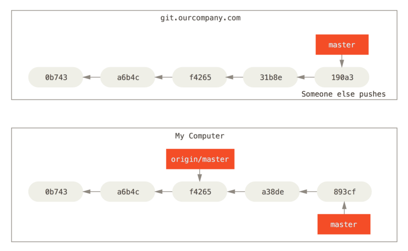

# Lecture 14: Version control and git part 2

- Reading (if you want more detail): [Pro Git](https://git-scm.com/book/en/v2), Chapters 1, 2, 3, 10.


# Remember: Commits and Branches

- A _commit_ is a snapshot of the project at a certain point in time.

- A _branch_ is a pointer to a commit.

- Each commit is stored as a file, containing a hash of the tree for the top-level directory, hash of the parent commit, and meta-information about the commit.

- By default, a commit has as its parent the commit that HEAD was pointing to when you made the commit.

# Merging and rebasing

Setup:

- You have a branching commit history

- You want to incorporate changes made in two different branches

. . .

Solutions:

- Merge: Make a new commit with two parents

- Rebase: Applies changes from one branch onto another

# Fast-forward merge

Setup: We have two commits, `branch1` and `branch2`, and `branch1` is an ancestor of `branch2`.

We would like to update so that `branch1` points to the same commit as `branch2`.

Solution: fast-forward merge

```
git checkout branch1
git merge branch2
```

What happens?

- `branch1` moves to point to the same commit as `branch2`

# For example


-----

After running 

```
$ git checkout master
$ git merge hotfix
Updating f42c576..3a0874c
Fast-forward
 index.html | 2 ++
 1 file changed, 2 insertions(+)
```

-----


# Basic merge

Setup: We have a diverged work history with `branch1` and `branch2`.

We want to integrate the changes represented by both branches.

We can _merge_ the two branches:

```
git checkout branch1
git merge branch2
```

-----

What happens?

- Find the most recent common ancestor of `branch1` and `branch2`

- Find all the differences between `branch2` and the most recent common ancestor

- Apply those changes to `branch1` to get a new commit

- The new commit is special in that it has two parents: the commit that `branch1` was pointing to _and_ the commit that `branch2` was pointing to.

-----

Starting out:


-----

How we want the merge to look:


-----

After running

```
git checkout master
git merge iss53
```


# Merge conflicts

Sometimes merging doesn't work automatically, usually because you made different changes to the same file on different branches.

If this happens, you'll get a message telling you that the merge can't be performed automatically:

```
$ git merge iss53
Auto-merging index.html
CONFLICT (content): Merge conflict in index.html
Automatic merge failed; fix conflicts and then commit the result.
```

If you run `git status`, you get instructions about what to do:

```
$ git status
On branch master
You have unmerged paths.
  (fix conflicts and run "git commit")

Unmerged paths:
  (use "git add <file>..." to mark resolution)

    both modified:      index.html

no changes added to commit (use "git add" and/or "git commit -a")
```

-----

In this case, the file `index.html` will contain a section that looks like this:

```
<<<<<<< HEAD:index.html
<div id="footer">contact : email.support@github.com</div>
=======
<div id="footer">
 please contact us at support@github.com
</div>
>>>>>>> iss53:index.html
```

- The version in HEAD is in the first section (between `<<<` and `===`), and the version in `iss53` is in the second section (between `===` and `>>>`).

- Git doesn't know which changes you want in the final merge, so you have to choose which one to keep (or do something else entirely).

-----

Resolving the conflict:

- Edit the file(s) with the merge conflicts.

- Run `git add` on those files.

- Run `git commit` to make the merge commit.

-----

After fixing merge conflicts and running `git add index.html`:

```
$ git status
On branch master
All conflicts fixed but you are still merging.
  (use "git commit" to conclude merge)

Changes to be committed:

    modified:   index.html
```

# Rebase

Setup: We have a diverged work history with `branch1` and `branch2`.

We want to integrate the changes represented by both branches.

One solution is rebasing `branch2` onto `branch1`:

```
git checkout branch2
git rebase branch1
```

----

What happens?

- Find the most recent common ancestor of `branch1` and `branch2`

- Find all the differences between `branch2` and the most recent common ancestor

- Apply those changes to `branch1` to get the new commit

Same result as what we would get from a merge commit, but the history is different.

-----

Starting out:


-----

After running:

```
git checkout experiment
git rebase master
```


-----

After running:

```
git checkout master
git merge experiment
```


# Remotes

- A _remote repository_ is a version of the project that is hosted somewhere else (e.g. GitHub).

- Just like your local repository, the remote repository is a collection of commits and branches.

- Reading from and writing to remote repositories is how people collaborate on projects with git.

- You can have more than one remote repository for a project.

- Main issues in working with remotes are reading and writing commits and branches, and being able to refer to branches on the remote.

- We will have a lot of different kinds of branches:
   - Local branches (last time)
   - Remote branches (Branches on the remote)
   - Remote-tracking branches (How you refer to branches on the remote)
   - Tracking branches (Allows you to push to and pull from branches on the remote automatically)

# Showing the remotes

To see the remote servers corresponding to your project that you have set up, use `git remote`, or `git remote -v`.

For example:

```
$ git clone https://github.com/schacon/ticgit
Cloning into 'ticgit'...
remote: Reusing existing pack: 1857, done.
remote: Total 1857 (delta 0), reused 0 (delta 0)
Receiving objects: 100% (1857/1857), 374.35 KiB | 268.00 KiB/s, done.
Resolving deltas: 100% (772/772), done.
Checking connectivity... done.
$ cd ticgit
$ git remote
origin
```

```
$ git remote -v
origin	https://github.com/schacon/ticgit (fetch)
origin	https://github.com/schacon/ticgit (push)
```

-----

If you had multiple remotes, you might get something like this:

```
$ cd grit
$ git remote -v
bakkdoor  https://github.com/bakkdoor/grit (fetch)
bakkdoor  https://github.com/bakkdoor/grit (push)
cho45     https://github.com/cho45/grit (fetch)
cho45     https://github.com/cho45/grit (push)
defunkt   https://github.com/defunkt/grit (fetch)
defunkt   https://github.com/defunkt/grit (push)
koke      git://github.com/koke/grit.git (fetch)
koke      git://github.com/koke/grit.git (push)
origin    git@github.com:mojombo/grit.git (fetch)
origin    git@github.com:mojombo/grit.git (push)
```

# Adding remote repositories

With `git clone`:

- By default, if you run `git clone <url>`, git will add `<url>` as a remote repository with the name `origin`.

- Nothing special about the name `origin`

With `git remote add`:

- `git remote add <shortname> <url>` will add `<url>` as a remote repository with the name `<shortname>`


# Fetching from remote repositories

To get new commits that have been added to a remote repository, run `git fetch <remote>`

What happens?

- Any commits that are on `<remote>` that you don't have are downloaded and added to your repository.

- Remote-tracking branches are updated

-----


-----



-----


# Remote-tracking branches

Problem: how do we refer to branches in the remote? There's nothing preventing the remote from having branches with the same name as our local branches but that point to different commits.

Solution: remote-tracking branches:

- Have names of the form `<remote>/<branch-name>`.

- You can't modify these, they refer to a branch in the remote repository.


# Inspecting remotes

If you want more information about a remote, you can use `git remote show <remote-name>`.

For example:

```
$ git remote show origin
* remote origin
  Fetch URL: https://github.com/schacon/ticgit
  Push  URL: https://github.com/schacon/ticgit
  HEAD branch: master
  Remote branches:
    master                               tracked
    dev-branch                           tracked
  Local branch configured for 'git pull':
    master merges with remote master
  Local ref configured for 'git push':
    master pushes to master (up to date)
```

-----

A more complicated example:

```
$ git remote show origin
* remote origin
  URL: https://github.com/my-org/complex-project
  Fetch URL: https://github.com/my-org/complex-project
  Push  URL: https://github.com/my-org/complex-project
  HEAD branch: master
  Remote branches:
    master                           tracked
    dev-branch                       tracked
    markdown-strip                   tracked
    issue-43                         new (next fetch will store in remotes/origin)
    issue-45                         new (next fetch will store in remotes/origin)
    refs/remotes/origin/issue-11     stale (use 'git remote prune' to remove)
  Local branches configured for 'git pull':
    dev-branch merges with remote dev-branch
    master     merges with remote master
  Local refs configured for 'git push':
    dev-branch                     pushes to dev-branch                     (up to date)
    markdown-strip                 pushes to markdown-strip                 (up to date)
    master                         pushes to master                         (up to date)
```


# Tracking branches

Tracking branches: not the same as remote-tracking branches

- A local branch that has a relationship with a remote-tracking branch.

- The branch it tracks is called the 'upstream'.

When/how are they created?

- By default, all of the branches in the remote repository will be available to you with names `<remote>/<branch-name>`.

- Also by default, when you clone a repository, git will automatically create a branch `master` that tracks `origin/master`.

- If you want to track other remote branches, you can use `git checkout -b <branch> <remote>/<branch>` or `git checkout --track <remote>/<branch-name>`, which will create a local branch called `<branch-name>` that tracks `<remote>/<branch-name>`.

What are they for?

- Setting defaults for pushing

- Setting defaults for pulling

# Pushing to remote repositories

Method 1: Explicitly naming the local and remote branches

- `git push <local-branch-name>:<remote-branch-name>` will push the commits in `<local-branch-name>`to `<remote>/<remote-branch-name>`

- Take my local branch `<local-branch-name>` and make it the remote's branch `<remote-branch-name>`

- You can use shorthands: if the two branches have the same name, can just use `git push <branch-name>`.

Method 2: If you are on a tracking branch

- Can use `git push` with no extra arguments

- This is equivalent to pushing the tracking branch you are currently on to the tracking branch's upstream branch in the remote

Note:

- This only works if nobody has pushed to the branch you're pushing to since you last fetched from the remote.

- If someone else has pushed in the meantime, you need to fetch their commits and integrate their work with yours (by e.g. merging or rebasing your commits).

# Pulling

Setup: You are on a tracking branch, and you want to get any new commits from the upstream branch on the remote.

You can use `git pull`, which is usually equivalent to `git fetch` plus `git merge <tracking-branch> <remote>/<upstream>`, where `<tracking-branch>` is the branch that you are currently on, and `<remote>/<upstream>` is the upstream branch that your `<tracking-branch>` tracks.

# Back to the example

```
$ git remote show origin
* remote origin
  URL: https://github.com/my-org/complex-project
  Fetch URL: https://github.com/my-org/complex-project
  Push  URL: https://github.com/my-org/complex-project
  HEAD branch: master
  Remote branches:
    master                           tracked
    dev-branch                       tracked
    markdown-strip                   tracked
    issue-43                         new (next fetch will store in remotes/origin)
    issue-45                         new (next fetch will store in remotes/origin)
    refs/remotes/origin/issue-11     stale (use 'git remote prune' to remove)
  Local branches configured for 'git pull':
    dev-branch merges with remote dev-branch
    master     merges with remote master
  Local refs configured for 'git push':
    dev-branch                     pushes to dev-branch                     (up to date)
    markdown-strip                 pushes to markdown-strip                 (up to date)
    master                         pushes to master                         (up to date)
```


# Summing up

- Both local and remote repositories are just sets of commits and branches.

- Primary problem is how to refer to branches in the remote.

- Defaults for pushing and pulling sometimes make things confusing.
