# Lecture 15: Version control and git

Reading (if you want more detail): 

[Pro Git](https://git-scm.com/book/en/v2), Chapters 1, 2, 3, 10.


# Git

Basic idea:

- Stores snapshots of the directory, these are _commits_

- If you've changed some things and don't like the results, you can go back to an older version and start over

- You can easily display differences between states of the directory at different points in time

- Allows multiple people to work on the same project

- Allows for resolving simultaneous changes as easily as possible

- We have a complete history of who changed what and why

. . .

Important conceptually are _commits_ and _branches_


# Commits

A _commit_ records the state of the repository at a particular point in time

Contains:

- Hash of the tree object for the top level directory

- Hash of the parent commit

- Meta-information about the commit (author, commit message, date, etc.)

You should think of git as storing a set of commits.

# Branches

- A _branch_ is a pointer to one commit.

- By default, you start off with a branch called `master`, but you can make more, and with any names you want.

- There is nothing special about the `master` branch.

. . .

Problem: if you're making changes (= adding commits), you probably want a pointer to the most recent commit. We would like branches to move when we make a new commit.

# HEAD

HEAD solves the problem of updating branches after commits.

- HEAD is a pointer to a branch.

- When you make a new commit, the branch HEAD points to moves to the new commit.

The `checkout` function allows you to change the branch HEAD points to.

-----

Start with three commits, two branches

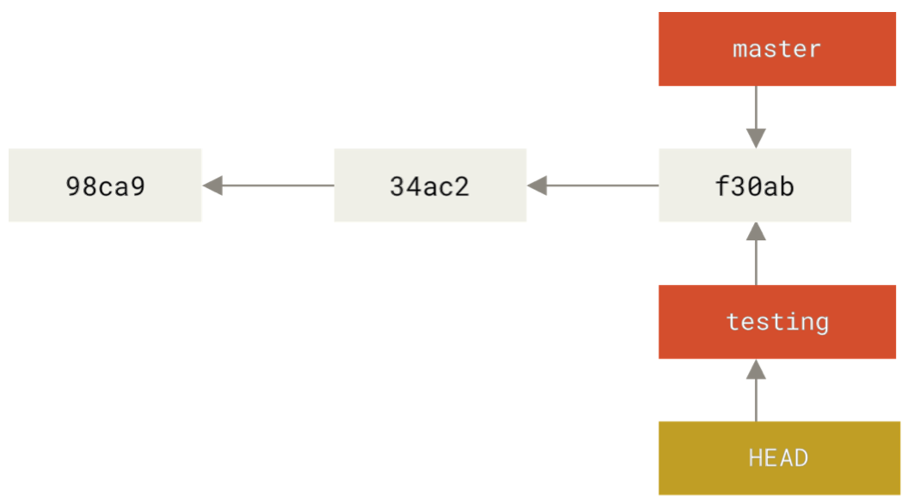

-----

Add a commit:

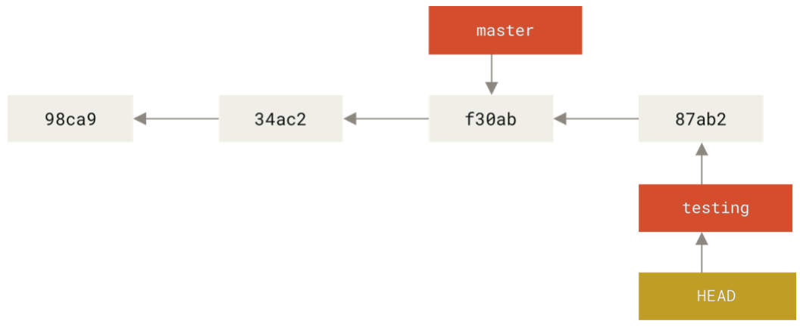

-----

Switch branches with checkout:

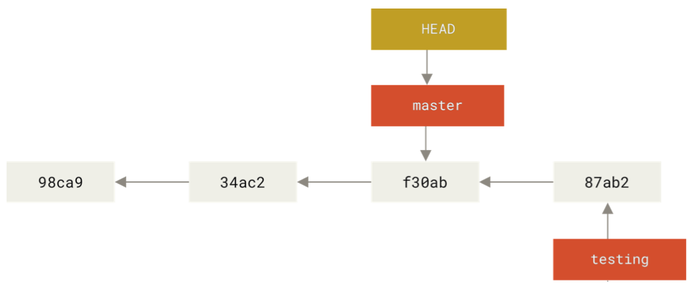


# Merging and rebasing

Setup:

- You have a branching commit history

- You want to incorporate both sets of changes

. . .

Solutions:

- Merge: Make a new commit with two parents

- Rebase: Applies changes from one branch onto another

# Merge

Starting out:

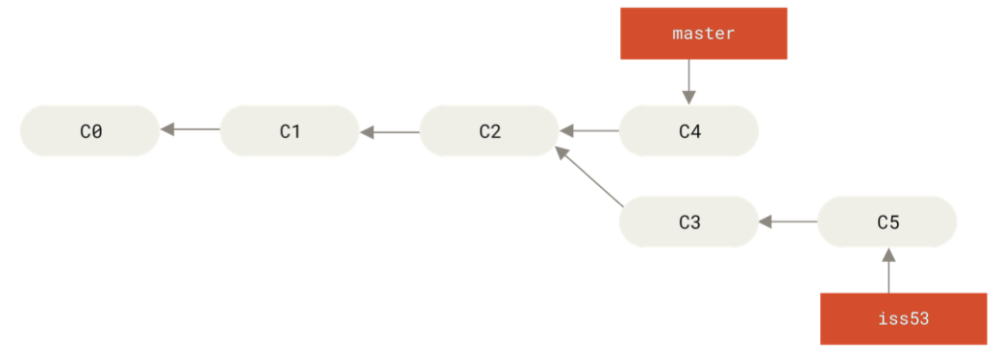

-----

How we want the merge to look:

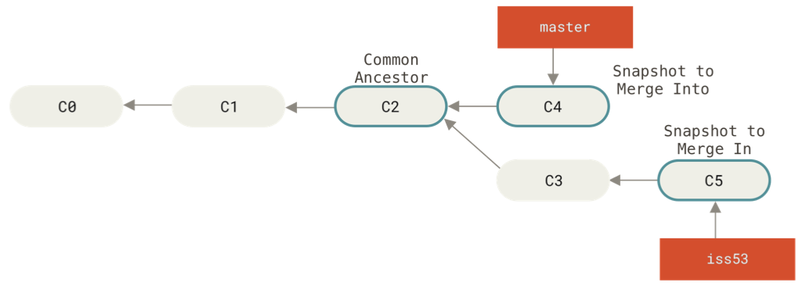

-----

After running

```
git checkout master
git merge iss53
```

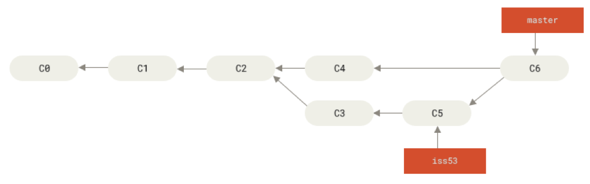

# Rebase

Rebasing `branch2` onto `branch1`:

- Find the most recent common ancestor of `branch1` and `branch2`

- Find all the differences between `branch2` and the most recent common ancestor

- Apply those changes to `branch1`

-----

Starting out:

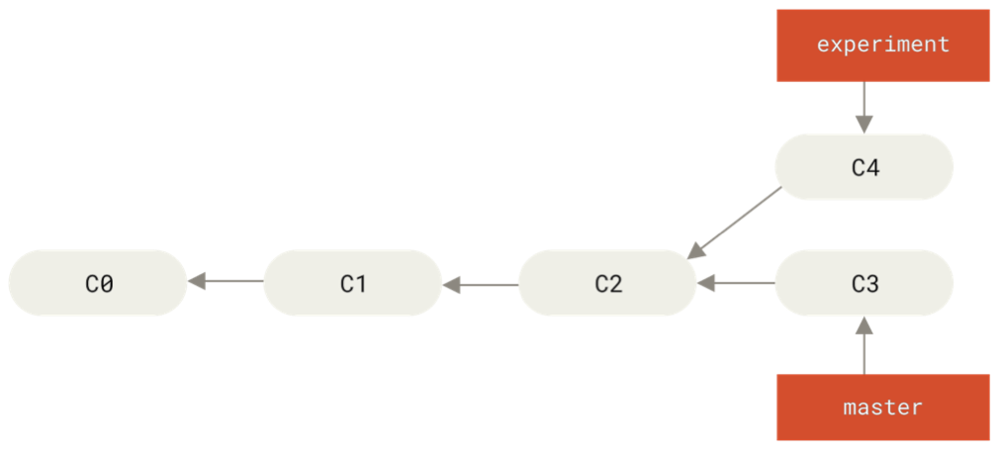

-----

After running:

```
git checkout experiment
git rebase master
```

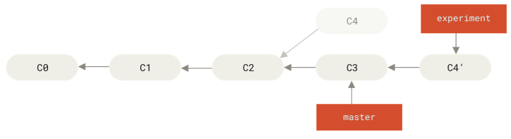

-----

After running:

```
git checkout master
git merge experiment
```

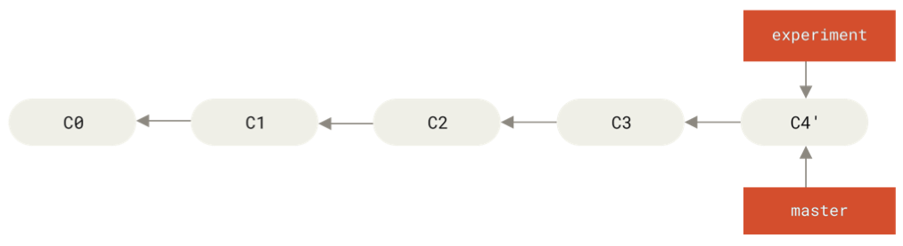


# How all the data is stored

Three basic types of objects:

- blobs: contents of a file

- trees: an object describing the contents of a directory

- commits: an object describing the state of the repository at a particular point in time

All these objects are stored by their _hash_


# Hashes

- A _hash_ is a tool from computer security for checking whether data has been tampered with

- Git uses [SHA1](https://en.wikipedia.org/wiki/SHA-1)

- This is a function that takes data of any size and produces a 20-byte hash value.

- This is usually displayed as a 40-digit hexadecimal number.

- Idea behind a hash function is that small perturbations in the data lead to large changes in the hash value, and the function is designed to be difficult to invert (if you're given a hash value, it's hard to create a file that has that value)

- Every object is referred to by its hash value

# Blobs

- Blobs store the contents of a file

- Name is the hash value of the contents of the file

# Trees

- Blobs just store the contents of the file

- Trees store the file name and the directory structure

To see the tree, you can use:

```
git cat-file -p master^{tree}
```

And the output might look like this:

```
100644 blob 01b480b010b7fe66e312e1271dd24e128f3a0290	.gitmodules
100644 blob 1d17afb2a980076fc389f3d2747b0bfefd4df839	Dockerfile
100644 blob 716007c1456163b933cb086acae151fc6a24ca6d	README.md
100644 blob 9af5513cf53dfbdedbc69ec43865dec054de0ccd	SConstruct
040000 tree 100d47915afe22615ff111d390170c7265900b7a	analysis
```

-----

Conceptually, if we have a directory containing 

- `README`,

- `Rakefile`,

- A subdirectory called `lib`,

- A file `samplegit.rb` in `lib`,

Git would store a snapshot of the directory as three blobs and two trees:

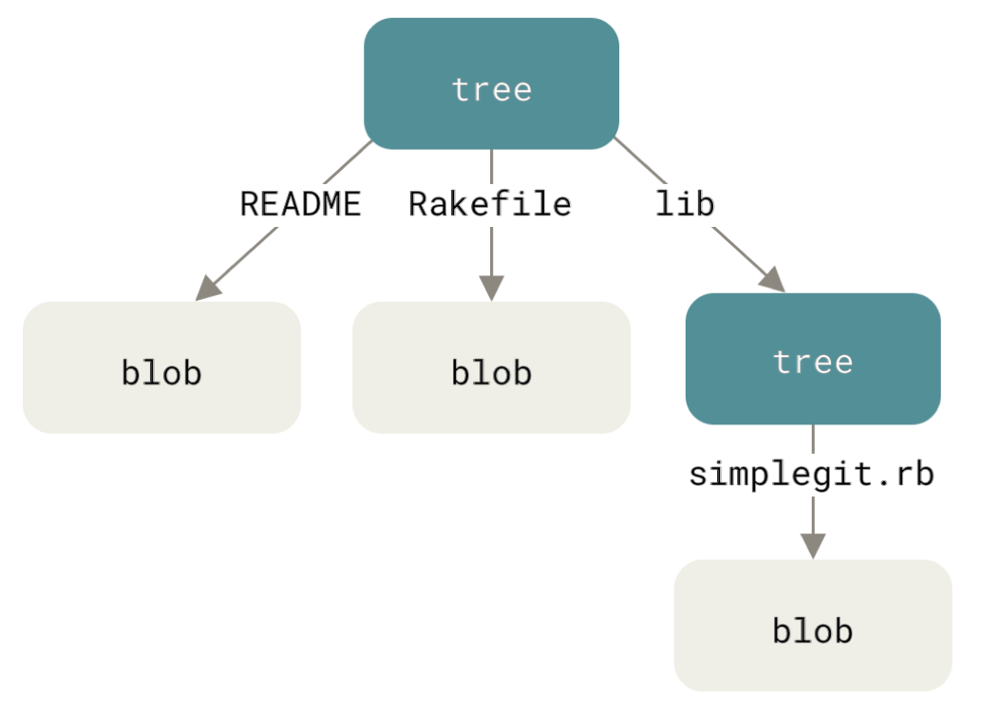


# Commits

- Commits are also referred to by their hashes.

- They are files with information about the parent commit, the hash of the tree describing the directory structure for that commit, and some metadata about the commit.

-----

Putting everything together, we get a graph that describes the files that were present at different commits:

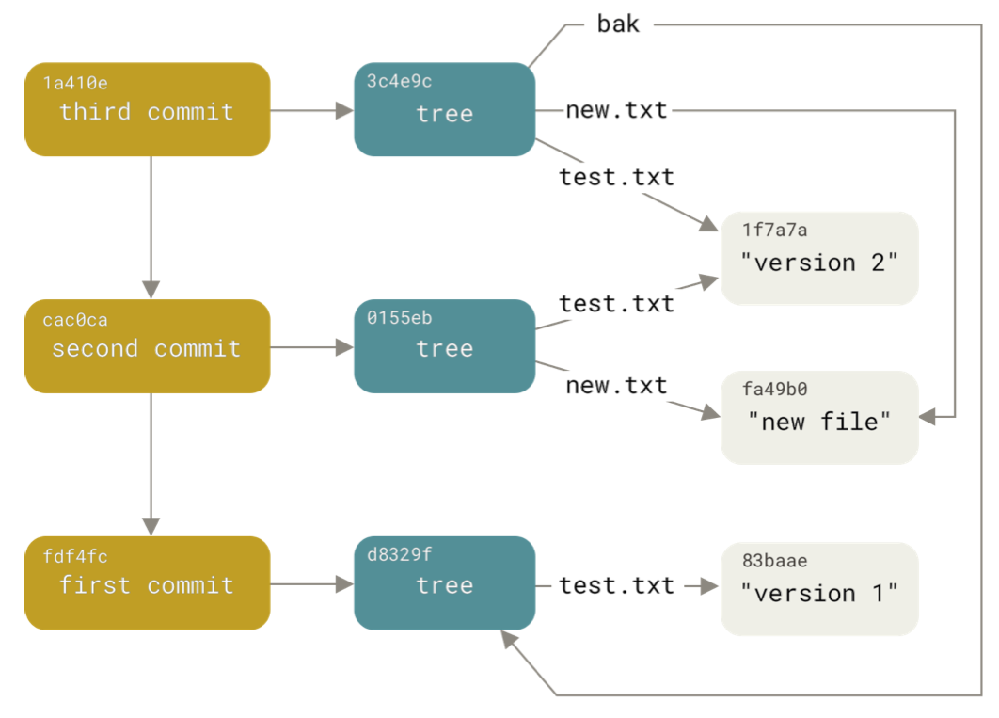


# How to create a commit

Remember: a commit is a snapshot of the directory structure

- You don't necessarily want to record _all_ of the changes you've made since the previous commit.

- To allow you to specify which changes you want to record for the commit, git uses a _staging area_ (also called the _index_).

- When you modify files that you want to commit, you add them to the staging area.

- Once you have the staging area in a state you like, you can commit the stages from the staging area and they are added to the repository.

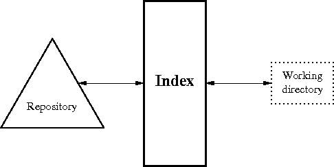

-----

For example:

```
git init test
cd test
git status
echo "test file" > test.txt
git status
```

-----

Now we have one untracked file, which means it is not in the staging area.

If we run

```
git add test.txt
git status
```

We get output

```
On branch master

No commits yet

Changes to be committed:
  (use "git rm --cached <file>..." to unstage)

	new file:   test.txt

```

which tells us that `test.txt` is now in the staging area.

-----

We can now commit what we have in the staging area:

```
git commit -m "first commit"
```

which will give us:
```
[master (root-commit) 8e9c4cc] first commit
 1 file changed, 1 insertion(+)
 create mode 100644 test.txt
```

. . .

This tells us:

- Our repository now contains a new commit, whose hash starts with `8e9c4cc`

- We've changed one file

- We've added a new object to the repository, `test.txt`

# Overall

- A git repository contains a set of commits, which describe the contents of a directory at a certain point in time

- The main things we want to be able to do are add new commits and move to different commits

- A branch is just a name for a specific commit, and it allows us to move between different commits without referring to them by their name/hash
