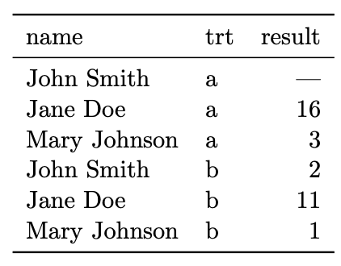
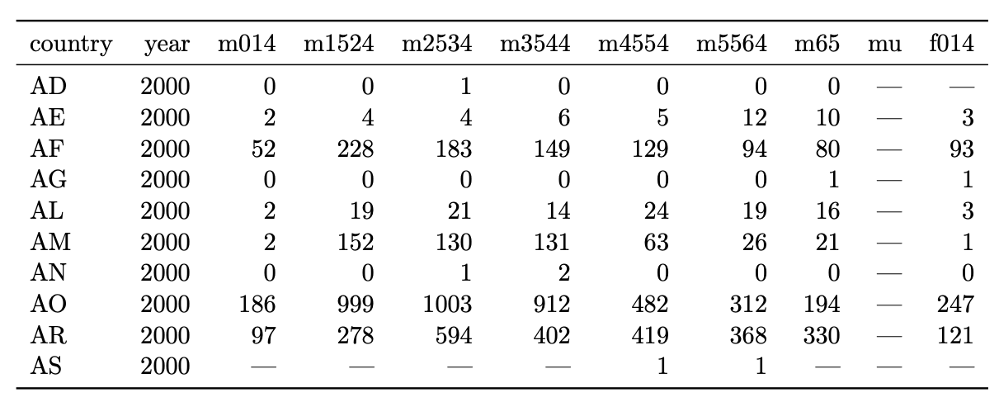

## More on data manipulation, shape changing, merging, transformations

Reading: Hadley Wickham,
["Tidy Data"](http://vita.had.co.nz/papers/tidy-data.pdf) and
["Reshaping data with the reshape package"](http://had.co.nz/reshape/introduction.pdf)

Agenda for today:

- Reshaping/tidy data/wide vs. long format

- Merging

-----

## Tidy data

We usually want our data in the folowing form:

- In a rectangular data frame

- One row per observation

Data don't always come this way!

. . .

Even if the data do satisfy the "one row per observation" rule for one
analysis, they don't necessarily do so for another, and we often need
to change the "shape" of the data.

## Data semantics

Three concepts:

- Values

- Variables

- Observations

Datasets contain _values_, each of which belongs to a _variable_ and
an _observation_.


-----

Datasets can encode these in a lot of different ways. The "tidy" way
is to have

- Each variable a column

- Each observation a row

- Each cell a value

This is usually the way that other functions want the data to come in.

-----

For example:


What is easy to do with data in this format?

- See which treatment worked better for each individual.

- Run a paired t-test on treatment a vs. treatment b.

What is hard to do with data in this format?

- Run a linear model with result modeled as a function of treatment.

- Subset the data to the observations corresponding to a specific treatment (not hard so much as not programmatically nice).

-----

Same information:



What is easy to do with data in this format?

- Run a linear model with result modeled as a function of treatment.

- Subset to observations corresponding to one treatment.

What is hard?

- Compute treatment a - treatment b.

- Run a paired t-test.

-----

Another example:



Easy:

- See overall numbers of cases for each country.

- Compare some of the age ranges.


Hard:

- Plot cases as a function of sex, age, country, year.

- Model cases as a function of sex, age, country, year.

-----


Easy:

- Plot cases as a function of sex, age, country, year.

- Model cases as a function of sex, age, country, year.

Hard:

- Compute differences between number of cases in different categories (e.g. differences in cases between males and females holding all the other categories constant).

- See overall number of cases (not as compact as the other way).

-----

## General rules of thumb

- Columns are all special (accessed by name) and rows are not special (accessed programmatically).

- Easy to define functional relationships between variables (e.g. difference between two variables)/hard to define functional relationships between rows.

- Easy to subset rows/hard to subset columns.

- Easy to aggregate over rows/hard to aggregate over columns.

## Reshaping

The term for transforming these datasets into each other is called
"reshaping", and pretty much all reshaping can be done with a
combination of two operations: melting and casting.

- Melting: Taking a wide dataset and making it long.

- Casting: Taking a melted dataset and making it wide.

The mneumonic is that you first "melt" the data set and then you
"cast" it. The "molten" data isn't usually the final form you want it
to be in, but it allows you to change it into other shapes easily.

## Melting data

The `melt` function takes data from wide form to long form.

Conceptually, we have two sets of variables:

- Identification variables, that describe the observations, and

- Measurement variables, which are the quantities that are measured for each observation. If you want to do any aggregation later, it will be over the measurement variables.

To melt a dataset, you need to decide what these are.

-----

What does a molten data table look like?

- Columns (potentially more than one) for id variables.

- If there is more than one measured variable, one column describing
the variable measured.

- One column for the value of the measured variable on the corresponding
observation.


## Melting

Based on what we said before, we will need to provide data, id
variables, and measurement variables, but in practice we have two
distinct situations:

- Matrix or array input: here we assume that the id variables are the
dimensions of the matrix or array, and the measurement variables are
the elements of the matrix or the array. Therefore, we don't actually
specify id variables or measurement variables.

- Data frame input: id variables and measurement variables have to be specified.


## Melting data frames

Let's see an example. (Actually a very interesting study, can read [here](https://www.researchgate.net/publication/226555631_Frying_Performance_of_No-trans_Low-Linolenic_Acid_Soybean_Oils).)

```{r}
head(french_fries)
```

-----

We want to melt this data frame so that 

- `id.vars` are time, treatment, subject, rep

- `measure.vars` are the remainder: potato, buttery, grassy, rancid, painty

```{r}
head(melt(french_fries, id.vars = c("time", "treatment", "subject", "rep"),
     measure.vars = c("potato", "buttery", "grassy", "rancid", "painty")))
```

-----

You can specify just one of `id.vars` and `measure.vars`, in which
case the function will assume that all the other variables should be
in the other class.

You can also specify the variables by number instead of by name.

```{r}
head(melt(french_fries, id.vars = 1:4))
head(melt(french_fries, measure.vars = 5:9))
```

-----

. . .

If you don't specify either, the function will assume that all the
factor variables should be id variables and all of the numeric
variables should be measured variables.

```{r}
plyr::ldply(french_fries, class)
head(melt(french_fries))
```

-----

You can make the output slightly nicer by specifying variable names
and value names:

```{r}
head(melt(french_fries, id.vars = 1:4, variable.name = "flavor", value.name = "flavor_intensity"))
```

-----


## Melting arrays

- Assume that the id variables are the dimensions of the array

- Assume the measured variable is stored as elements in the array.

- We don't specify id variables or measurement variables.

Therefore, the syntax is simply `melt(array)`

-----

For example:

```{r}
HairEyeColor
melt(HairEyeColor)
```

-----

There are a couple of optional arguments for making the output a
little nicer, like giving a different name to the column in the output
describing the measured value:

```{r}
melt(HairEyeColor, value.name = "number")
```


## Casting

reshape2 uses `*cast`: either `dcast` or `acast` for data frame or
array output, respectively.

Syntax: `*cast(data = mdata, formula = row_var_1 + ... + row_var_n ~ col_var_1 + ... +
col_var_m, value.var)`

- `mdata` should be a molten data set

- The columns of the output will be all the combinations of `col_var_1`, ..., `col_var_n`

- The rows of the output will be all the combinations of `row_var_1`, ..., `row_var_n`

- `value.var` is the value variable, the values that should go in the cells of the output. If you don't specify it, `melt` will guess.


-----

Example

. . .

```{r}
ff_m <- melt(french_fries, id.vars = 1:4, variable.name = "flavor", na.rm = TRUE)
head(ff_m)
cast_ex_1 <- dcast(ff_m, time + treatment ~ subject + rep + flavor, value.var = "value")
cast_ex_1[1:5,1:5]
## check to see if the numbers match
subset(ff_m, time == 1 & subject == "3" &  rep == 1 & flavor == "potato")
```

## Aggregation and casting

When you cast data, you often don't use all of the variables.

This means that each element of the cast table will correspond to more
than one measurement, and so they need to be aggregated in some way.

. . .

```{r}
head(ff_m)
dcast(ff_m, time ~ flavor, value.var = "value")
```

-----

The aggregation function is specified with `fun.aggregate`:

```{r}
dcast(ff_m, time ~ flavor, value.var = "value", fun.aggregate = mean)
```

-----

A couple of other notes:

- You can use `...` to represent all the other variables in the formula.

- The order that you specify the variables in the formula matters for the way the output is ordered: the first variables change most slowly, and the later ones change more quickly. This is mainly important for looking at the data.

- `acast` will give you array output instead of data frame output.

-----

Example of different orders:

```{r}
dcast(ff_m, time + treatment ~ flavor, fun.aggregate = mean)
dcast(ff_m, treatment + time ~ flavor, fun.aggregate = mean)
```

-----

Example of `acast`. id variables are row names.

```{r}
acast(ff_m, time ~ flavor, fun.aggregate = mean)
acast(ff_m, time + treatment ~ flavor, fun.aggregate = mean)
```

## Merging 

Final topic: What if you have data from two different places and you
need to put them together?

Basic syntax: `merge(x, y, by.x, by.y)`

- `x` and `y` are the two datasets you want to merge.

- `by.x` is the column of `x` to merge on.

- `by.y` is the column of `y` to merge on.


-----

Example:

```{r}
cities <- data.frame(
    city=c('New York','Boston','Juneau',
           'Anchorage','San Diego',
           'Philadelphia','Los Angeles',
           'Fairbanks','Ann Arbor','Seattle'),
    state.abb=c('NY','MA','AK','AK','CA',
                'PA','CA','AK','MI','WA'))

states <- data.frame(state.name, state.abb)
cities
head(states)
```


We want to add the state name to the cities data frame, and we can use merge.

```{r}
merge(states, cities, by.x = "state.abb", by.y = "state.abb")
```

-----

Notice in the last example that there was some ambiguity in how the
merge took place because the two datasets have different sets of
values for `state.abb`.

- Default: the output dataset only has rows for which we had
values in both data frames.

. . .

Can modify with `all`, `all.x`, or `all.y`

- `all = TRUE` means that you get one row for values of the merging
variable that were seen in either `x` or `y`

- `all.x = TRUE` means you get one row for each value of the merging
variable that was seen in `x`

- `all.y = TRUE` means you get one row for each value of the merging
variable that was seen in `y`.

-----

```{r}
merge(states, cities, all.x = TRUE)
```
-----


Some additional notes:

- Default if you don't specify `by.x` and `by.y` is to use the columns
that are common to the two.

- `by.x`/`by.y` can have length more than 1, in which case we match
on the entire set of specified variables.

- Can use `by` instead of `by.x` and `by.y`, in which case the name of
the column to merge on has to be the same in both `x` and `y`.


## Some final notes

Merging, melting/casting, and split/apply/combine from last week are useful enough that there are multiple implementations.

You can use other implementations, but you shouldn't try to re-make them from scratch.

Some other options are:

- `join` in `plyr` does the same thing as `merge`

- `gather` and `spread`, and more recently `pivot_longer` and `pivot_wider` in the `tidyr` package do roughly the same thing as `cast` and `melt`.

- There are multiple iterations of reshape, `reshape2` was a redesign of `reshape`.
