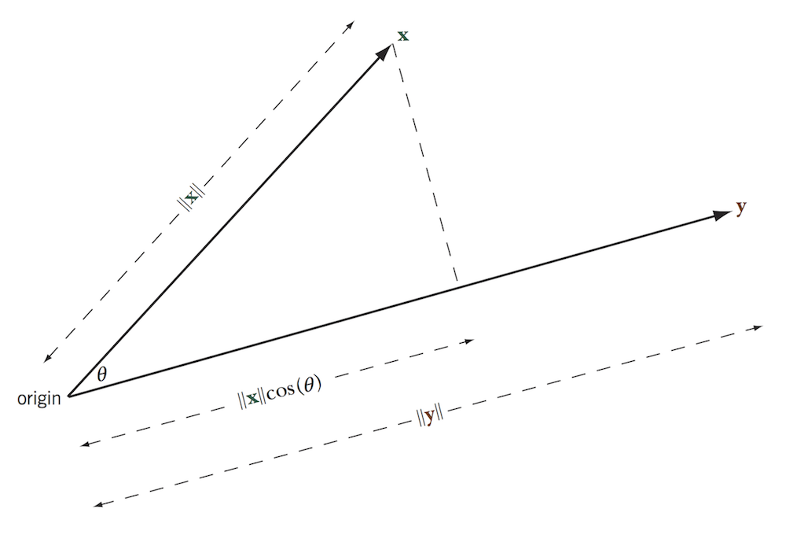
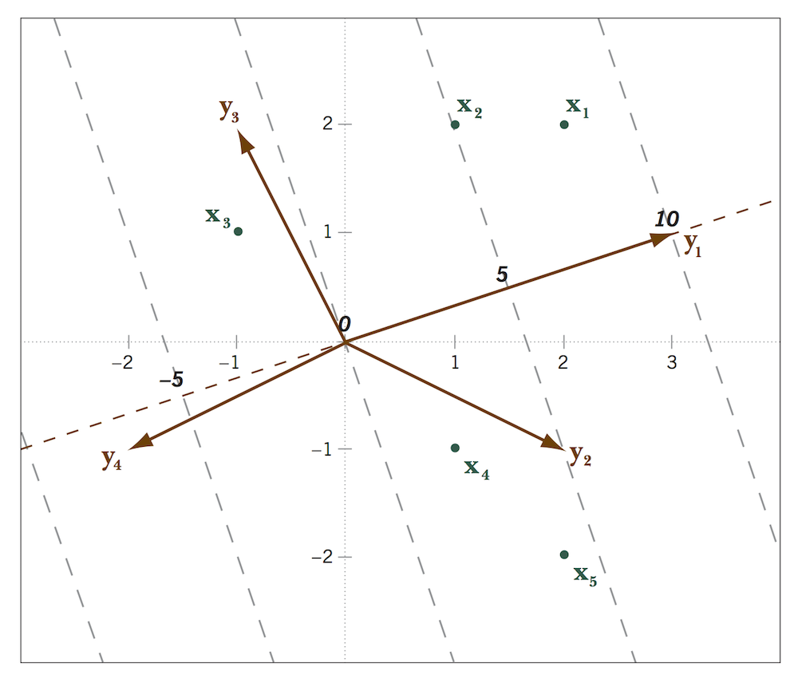

% Stat 470/670 Lecture 14: Background for Hypervariate Data
% Julia Fukuyama
% October 4, 2018

```{r setup, echo = FALSE}
library(knitr)
opts_chunk$set(fig.cap="", fig.width = 5, fig.height = 3, dpi=175, fig.path="lecture-14-fig/", warning = FALSE)
library(ggplot2)
library(ggrepel)
set.seed(0)
```

## Today

- Linear algebra review

- Introduce biplots

Reading: Greenacre, Biplots in Practice, Chapter 1. The [book website](http://www.multivariatestatistics.org/biplots.html) contains links to all the chapters, and chapter 1 is linked to on the course website for today's lecture. Also [here](http://www.fbbva.es/TLFU/dat/greenacre_c01_2010.pdf).

## Vectors and Matrices

- A _vector_ in $\mathbb R^n$ is given by a set of $n$ coordinates. We will write a vector $\mathbf x \in \mathbb R^n$ as $(x_1, x_2, \ldots, x_n)$.

. . .

- We think of vectors in $\mathbb R^2$ as points in the plane, vectors in $\mathbb R^3$ as points in 3-dimensional space, and vectors in $\mathbb R^n$ as points in $n$-dimensional space.

. . .

- A _matrix_ in $\mathbb R^{n \times p}$ consists of $n$ rows and $p$ columns. We will write such a matrix as
$$
\mathbf X = \begin{pmatrix}
\mathbf X_{11} & \mathbf X_{12} & \cdots & \mathbf X_{1p} \\
\mathbf X_{21} & \mathbf X_{22} & \cdots & \mathbf X_{2p} \\
\vdots & \vdots & \ddots & \vdots \\
\mathbf X_{n1} & \mathbf X_{n2} & \cdots & \mathbf X_{np}
\end{pmatrix}
$$
so that $\mathbf X_{ij}$ represents the element in the $i$th row and $j$th column of $\mathbf X$.

. . .

- A _column vector_ is a vector written as an $n \times 1$ matrix, and a _row vector_ is a vector written as a $1 \times n$ matrix.


## Scalar products

Suppose $\mathbf x$ and $\mathbf y$ are vectors in $\mathbb R^n$, then the scalar product of $\mathbf x$ and $\mathbf y$ is
$$
\mathbf x \cdot \mathbf y = \sum_{i=1}^n x_i y_i
$$

## Norm of a vector

Suppose $\mathbf x$ is a vector in $\mathbb R^n$. The _norm_ of $\mathbf x$ is defined as
$$
\| \mathbf x\| = \sqrt{\sum_{i=1}^n x_i^2}
$$

The norm is usually interpreted as a measure of size or length.

## Vector operation properties

- $\frac{\mathbf x \cdot \mathbf y }{ \|\mathbf x\| \|\mathbf y\|} = \cos(\theta)$, where $\theta$ is the angle between $\mathbf x$ and $\mathbf y$.

- $\mathbf x \cdot \mathbf y = 0$ means that $\mathbf x$ and $\mathbf y$ are orthogonal, i.e. that the angle between them is 90 degrees.

- If $\|\mathbf x\| = 1$ and $\|\mathbf y\| = 1$ (referred to as _unit vectors_), then $\mathbf x \cdot \mathbf y = 1 \in [-1, 1]$.

- If $\|\mathbf x\|$ and $\|\mathbf y\|$ are unit vectors, then $\mathbf x \cdot \mathbf y = 1$ implies the angle between the two vectors is $0$, and $\mathbf x \cdot \mathbf y = -1$ implies that the angle between the two vectors is $180$ degrees. This property motivates the interpretation of the scalar product as a measure of similarity.


## Geometry: Projection of one vector onto another



The length of the projection of $\mathbf x$ onto $\mathbf y$ is $\|\mathbf x \| \cos(\theta) = (\mathbf x \cdot \mathbf y) / \|\mathbf y\|$.

. . .

More useful form:
$$
\mathbf x \cdot \mathbf y = (\text{length of projection of $\mathbf x$ onto $\mathbf y$})\|\mathbf y\|
$$

This result is important for visualization because we can "read off" scalar products as projections.


## Matrix operations: Multiplication

Suppose $\mathbf X \in \mathbb R^{a \times b}$ and $\mathbf Y \in \mathbb R^{b \times c}$. Then the matrix product of $\mathbf X$ and $\mathbf Y$ is a matrix $\mathbf S \in \mathbb R^{a \times c}$, where the $i, j$ element of $\mathbf S$ is
$$
\mathbf S_{ij} = \sum_{k=1}^ b \mathbf X_{i k} \mathbf Y_{k j}
$$

. . .

Note: For the matrix multiplication operation to be defined for the matrices $\mathbf X$ and $\mathbf Y$, the number of columns of $\mathbf X$ must be equal to the number of rows of $\mathbf Y$.

## Matrix operations: Transpose

The matrix transpose operation flips the row and column indices. That is, $(\mathbf X^T)_{ij} = \mathbf X_{ji}$.

## Matrix multiplication written as scalar products

Note that we can write the matrix multiplication operation in terms of scalar products.

As before, suppose we have $\mathbf X \in \mathbb R^{a \times b}$ and $\mathbf Y \in \mathbb R^{b \times c}$.

Let $\mathbf x_1, \ldots, \mathbf x_a$ be column vectors containing the rows of $\mathbf X$, so that
$$
\mathbf X = \begin{pmatrix} \mathbf x_1^T \\ \vdots \\ \mathbf x_a^T \end{pmatrix}
$$
and let $\mathbf y_1, \ldots, \mathbf y_c$ be column vectors containing the columns of $\mathbf Y$, so that
$$
\mathbf Y = \begin{pmatrix} \mathbf y_1 & \cdots & \mathbf y_c \end{pmatrix}
$$

Then if $\mathbf S = \mathbf X \mathbf Y$, $\mathbf S_{ij} = \mathbf x_i \cdot \mathbf y_j$.

$$
\mathbf S = \begin{pmatrix}
\mathbf x_1 \cdot \mathbf y_1 & \mathbf x_1 \cdot \mathbf y_2 & \cdots & \mathbf x_1 \cdot \mathbf y_c\\
\mathbf x_2 \cdot \mathbf y_1& \mathbf x_2 \cdot \mathbf y_2 & \cdots & \mathbf x_2 \cdot \mathbf y_c\\
\vdots & \vdots & \ddots & \vdots \\
\mathbf x_a \cdot \mathbf y_1& \mathbf x_a \cdot \mathbf y_2& \cdots & \mathbf x_a \cdot \mathbf y_c
\end{pmatrix}
$$

## Biplot: the main idea

Suppose we have a matrix $\mathbf S \in \mathbb R^{n \times p}$.

The rows of $\mathbf S$ correspond to observations, and the columns of $\mathbf S$ correspond to the variables measured.

A biplot is a visualization of the matrix $\mathbf S$ that will allow us to read off

- The values of $\mathbf S$,

- The correlations between the variables,

- The similarities between the observations.

To do this, we combine our results about matrix multiplication as scalar products with our results describing scalar products in terms of projections of one variable onto another.

## Biplot definition

Suppose we have a matrix $\mathbf S \in \mathbb R^{n \times p}$. Further suppose that we can write $\mathbf S$ as
$$
\mathbf S = \mathbf X \mathbf Y^T,
$$
where $\mathbf X \in \mathbb R^{n \times 2}$ and $\mathbf Y \in \mathbb R^{p \times 2}$.

$\mathbf S$ is the _target matrix_, and $\mathbf X$ and $\mathbf Y$ are the _left_ and _right_ matrices, respectively.

In a biplot, we plot the rows of $\mathbf X$ and the rows of $\mathbf Y$.

The convention is that

- Rows of $\mathbf X$ are plotted as points, and are referred to as _biplot points_.

- Rows of $\mathbf Y$ are plotted as arrows, and are referred to as _biplot vectors_.

## An example

```{r}
X = matrix(c(2,2, 1,2, -1,1, 1,-1, 2,-2), ncol = 2, byrow = TRUE)
Y = matrix(c(3,1, 2,-1, -1,2, -2,-1), ncol = 2, byrow = TRUE)
## %*% is the matrix multiplication function in R
S = X %*% t(Y)
X
Y
S
```


## A toy biplot

The arrows are the biplot vectors, or the rows of $\mathbf Y$.

The points are the byplot points, or the rows of $\mathbf X$.

```{r, echo=FALSE}
Xplot = data.frame(X)
Xplot$name = paste("x", 1:nrow(X), sep = "")
Yplot = data.frame(Y)
Yplot$name = paste("y", 1:nrow(Y), sep = "")
ggplot() + geom_text_repel(aes(x = X1, y = X2, label = name), data = Xplot) +
    geom_point(aes(x = X1, y = X2), data = Xplot) +
    geom_text_repel(aes(x = X1, y = X2, label = name), data = Yplot) +
    geom_segment(aes(xend = X1, yend = X2, x = 0, y = 0), data = Yplot, arrow = arrow(length = unit(0.03, "npc"))) +
        coord_fixed() + xlab("") + ylab("")
```

How do we use this plot?

-----

## We can read off the elements of the original data matrix

Remember that we can write S as a matrix of scalar products.
$$
\mathbf S = \mathbf X \mathbf Y^T =
\begin{pmatrix}
\mathbf x_1 \cdot \mathbf y_1 & \mathbf x_1 \cdot \mathbf y_2 & \cdots & \mathbf x_1 \cdot \mathbf y_p \\
\mathbf x_2 \cdot \mathbf y_1 & \mathbf x_2 \cdot \mathbf y_2 & \cdots & \mathbf x_2 \cdot \mathbf y_p \\
\vdots & \vdots & \ddots & \vdots\\
\mathbf x_n \cdot \mathbf y_1 & \mathbf x_n \cdot \mathbf y_2 & \cdots & \mathbf x_n \cdot \mathbf y_p
\end{pmatrix}
$$
where $\mathbf x_i$ are vectors denoting the rows of $\mathbf X$ and $\mathbf y_i$ are vectors denoting the rows of $\mathbf Y$

What this means is that we can reconstruct any element of S by looking at the scalar product between the biplot point and the biplot vector corresponding to that element.

Remember that the scalar product between $\mathbf x_i$ and $\mathbf y_j$ is the length of the projection of $\mathbf x_i$ onto $\mathbf y_j$ times the length of $\mathbf y_j$.

## Biplot calibration

To read off absolute values, not just relative values, we need to calibrate the axes.

Suppose we are interested in the value in the target matrix for observation $i$, variable $j$.

Recall that
$$
\text{length of the projection of point $\mathbf x_i$ onto vector $\mathbf y_j$} = (\mathbf x_i \cdot \mathbf y_j) /\|\mathbf y_j\|,
$$
and the value of the target matrix is
$$
\mathbf S_{ij} = \mathbf x_i \cdot \mathbf y_j
$$

. . .

Therefore, if the value in the target matrix is $1$, the length of the projection of $\mathbf x_i$ onto $\mathbf y_j$ is $1 / \|\mathbf y\|$. This is the length of one unit along the biplot axis, and it tells us that

- If the biplot vector is long, the intervals between units on the biplot vector are short (and so values change quickly as we move along that axis).

- If the biplot vector is short, the intervals between units on the biplot vector are long (and so values change slowly as we move along that axis).

-----



## The biplot shows us correlation between variables and similarities between samples

The biplot shows us correlations between the variables.

- If two biplot axes lie in the same orientation, the observations have approximately the same relative positions on both. This translates to the variables being highly correlated.

The biplot shows us similarities between the samples

- If two biplot points lie close to each other, their projections along all of the biplot axes will be similar, implying that their values on all the variables are similar.

## Summing up

- Think of a biplot as a generalization of a scatterplot. In a scatterplot, you visualize two variables. Points represent observations, and you can read off the value each variable takes for each observation. In biplots, we can have as many variables as we want; we are no longer limited to two.

However....

- We can't always write our data matrix as the product of two matrices with only two columns. What do we do in the general case?
