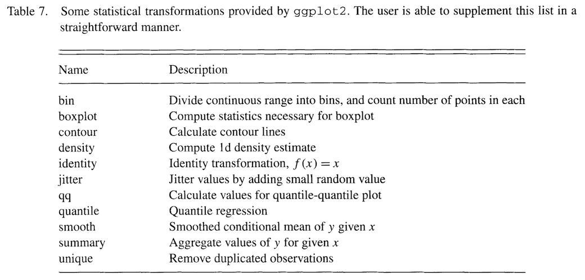

% Stat 470/670 Lecture 6: ggplot2, more formally
% Julia Fukuyama
% September 6, 2018

```{r setup, echo = FALSE}
library(knitr)
opts_chunk$set(fig.cap="", fig.width = 4, fig.height = 2.5, dpi=200, fig.path="lecture-6-fig/")
```

## Today

Reading: Wickham (2010), A Layered Grammar of Graphics, JCGS.

ggplot2 and the grammar of graphics


------

## Grammar of graphics

What does "grammar of graphics" mean?

The analogy with English grammar, or any language's grammar, is that it allows you to put together component parts

Better than "grammar of graphics" might be the "orthogonal components of graphics," but that doesn't have the same alliterative appeal.

The power of the grammar of graphics is that it is modular: different aspects of the plot can be specified independently of each other.

------

As an example, the coordinate system is specified separately from the geometric object used to represent the points.

Here we have three representations of the same data, the only difference between them being the coordinate system used to represent them.

```{r}
bar_plot = ggplot(diamonds) +
    geom_bar(aes(x = "", fill = clarity), width = 1, position = "stack")
bar_plot
bar_plot + coord_polar()
bar_plot + coord_polar(theta = "y")
```

-----

Again, the same dataset, three different coordinate systems, very different representations:

```{r}
dodged_bar_plot = ggplot(diamonds) +
    geom_bar(aes(x = "", fill = clarity), width = 1, position = "dodge")
dodged_bar_plot
dodged_bar_plot + coord_polar()
dodged_bar_plot + coord_polar(theta = "y")
```

## What are the components of a plot?

- A default dataset and set of mappings from variables to aesthetics.

- One or more _layers_, each of which contains one geometric (`geom_*`) object, one statistical transformation (`stat_*`), one position adjustment (`position_*`), and one dataset and set of aesthetic mappings.

- One scale for each aesthetic mapping.

- A coordinate system (`coord_*`).

- A facet specification (`facet_*`).

Layers are the most important and involved part of the plot.


## Layers

ggplots are composed of one or more layers

- If you want anything to show up, you need to create a layer: any of the `geom_*` or `stat_*` commands create a layer for you.

- Layers can also be created by hand using the `layer` command, and we'll see that today for teaching purposes, but in practice you make layers with `geom_*` or `stat_*`

- The `ggplot` function on its own does not create a layer.

## What is a layer?

- data and aesthetic mapping

- statistical transformation (stat)

- geometric object (geom)

- position adjustment

. . .

```{r}
p = ggplot() + geom_point(aes(x = color, y = clarity), data = diamonds)
p$layers
```


## Data and aesthetic mapping

Data: self evident. For ggplot the data needs to be formatted as a tibble or a data.frame.

Aesthetic mapping:

- Describes how variables in the dataset are mapping to "aesthetic" attributes of the plot.

- "Aesthetic" here means perceivable: something you can observe on the plot.

- Examples of aesthetic attributes/perceivable attributes: position along the $x$-axis, color, shape, position along the $y$-axis, opacity, linetype

Data and aesthetic mapping go together because they are not at all independent of each other: the aesthetic mapping takes variables in your data and maps them to aesthetics/perceivable parts of the plot and is therefore specific to a dataset.

## Statistical transformation

A statistical transformation is some transformation of the data.



There's some overlap between these and position adjustments: often there is more than one way to create the same plot.


## Geometric object

Geometric objects (`geom_*`) control the type of plot you create. Examples are

- Points, text (zero-dimensional geometric objects)

- Line, path (one-dimensional geometric objects)

- Polygon, interval (two-dimensional geometric objects)

- More complicated: boxplot


## Relationship between stats and geoms

Every statistic has a default geometric object, and every geometric object has a default statistic.

Stats and geoms are not completely orthogonal: not every combination is valid (although many are).

For example:

- `stat_bin` and `geom_bar` is valid and standard for a histogram.

- `stat_bin` and `geom_point` or `stat_bin` + `geom_line` are valid but non-standard combinations. They give a plot that is similar to a histogram and that is interpretable in the same way.

- `stat_identity` and  `geom_boxplot` is invalid, because boxplot needs certain computed quantities from the data.


## Position adjustment

Used to avoid "collisions" in the plot objects:

- In bar plots where one of the aesthetics is height, the bars would often be plotted over each other. In this case we use the "dodge" or "stack" position adjustments.

- If we have issues with overplotting (multiple points in exactly the same place), we can use the "jitter" position adjustment to randomly move the points a small amount.

```{r}
p = ggplot(diamonds) + geom_boxplot(aes(x = color, y = price))
p
p$layers
```

```{r}
ggplot(diamonds) + geom_boxplot(aes(x = color, y = price, color = clarity), position = "identity")
```

```{r, fig.width = 6}
ggplot(diamonds) + geom_boxplot(aes(x = color, y = price, color = clarity), position = "dodge")
ggplot(diamonds) + geom_boxplot(aes(x = color, y = price, color = clarity), position = position_dodge(width = 1))
```

`position = "dodge"` is the default for boxplots, so you don't need to specify it.


## Scales

So far, we've defined aesthetic mappings that specify which perceivable aspects of the plot correspond to which variables.

However, there any many ways to map variables to perceivable aspects of the plot.

For example, if we have a categorical variable that takes values "A" and "B" to the color aesthetic, that means that color is going to represent whether variable took value "A" or "B". But we could do that in a practically infinite number of ways, e.g.

- A maps to "red", B maps to "black"

- A maps to "green", B maps to "blue"

- A maps to "purple", B maps to "gold"

- ... You probably get the picture

-----

ggplot has good default mappings from values into aesthetic space*, but you will sometimes want to set them by hand.

To do so, you use the `scale_*` functions.

*This is true now: the old version of ggplot had poor mappings from continuous values to colors, and the [viridis](https://cran.r-project.org/web/packages/viridis/index.html) color scheme was much better. The most recent version of ggplot uses viridis by default for both continuous values and ordered factors.

## Coordinate system

Another aspect of the plot that can be specified independently of everything else is the coordinate system.

- `coord_cartesian` is the default, and is almost always what you want.

- `coord_flip` is sometimes useful: for example, boxplots require the explanatory variable to be mapped to x, so if you want a horizontal boxplot you need to use `coord_flip`.

- `coord_polar` will often make your plots look cooler and more difficult to read. Not usually recommended.

## Faceting

Allows you to make small multiples of plots.

Other grammars/plotting systems think of this as just a fancy coordinate system, but it turns out that it's easier to use if you think about it separately.

Each facet plots a subset of the data, and it takes as input what variable(s) to use to make the subsets and how to lay out the subsets.

The two options are:

- `facet_wrap`: Lays out the plots for each subset sequentially.

- `facet_grid`: Subsets the data according to two separate variables. The facet position along the $x$-axis represents levels of one variable, and the facet position along the $y$-axis represents levels of the other variable.


## How this all works: the long way

One way to specify a ggplot is to specify all of the components we've seen.

If you understand all the parts, this is probably the least confusing way to specify a ggplot.

The problem is that it's very verbose. Suppose we want to make a plot with points and a smoother from the diamonds dataset. We can specify data, mapping, geom, stat, and positions for each layer, along with scales and the coordinate system as follows:
```{r}
ggplot() +
    layer(
        data = diamonds, mapping = aes(x = carat, y = price),
        geom = "point", stat = "identity", position = "identity") +
    layer(
        data = diamonds, mapping = aes(x = carat, y = price),
        geom = "smooth", position = "identity", stat = "smooth", params = list(method = "lm")) +
    scale_x_log10() + scale_y_log10() + coord_cartesian()
```

## Defaults make the code shorter

The more standard way of writing the same plot would be:

```{r}
p = ggplot(data = diamonds, aes(x = carat, y = price)) +
    geom_point() +
    stat_smooth(method = "lm") +
    scale_x_log10() +
    scale_y_log10()
```

This is still fairly long, but we don't have to specify

- position: Default for both `geom_point` and `stat_smooth` is `position = "identity"`.

- stat, for `geom_point`: The default stat for `geom_point` is `stat = "identity"`.

- geom, for `stat_smooth`: The default geom for `stat_smooth` is `geom_smooth`.

- coordinate system: `coord_cartesian` is always the default.

-----

You can check what stat, geom, and position is used for each of the layers:
```{r}
names(p)
p$layers
```

## Example: Minard on Napoleon's invasion of Russia

One of [the most famous statistical graphics, created by Charles Minard](https://en.wikipedia.org/wiki/Charles_Joseph_Minard) depicts Napoleon's 1812 invasion of and retreat from Russia.


-----

```{r, fig.width=6}
minard = read_csv("../../datasets/minard.csv")
minard_cities = read_csv("../../datasets/minard-cities.csv")
plot_troops = ggplot(minard) +
    geom_path(aes(x = long, y = lat, color = direction, size = surviv, group = division))
plot_troops
```

-----

Let's add another layer for the cities:
```{r, fig.width=6}
plot_both = plot_troops +
    geom_text(aes(x = long, y = lat, label = city), data = minard_cities, size = 3)

plot_both
```

Notice: we have a new dataset for this layer.

. . .

Some things that we still don't like about this plot:

- We would like the colors for advance and retreat to be grey and red.

- We want the line widths to be proportional to the number of survivors.

- We would like the line ends to be round instead of square.

-----

A "final" version of the plot, with better scales:
```{r, fig.width=6}
ggplot(minard) +
    geom_path(aes(x = long, y = lat, color = direction, size = surviv^2, group = division), lineend = "round") +
    geom_text(aes(x = long, y = lat, label = city), data = minard_cities, size = 3) + 
    scale_size(range = c(.18, 15), breaks = (1:3 * 10^5)^2, labels = scales::comma(1:3 * 10^5), "Survivors") +
    scale_color_manual(values = c("grey50","red"), breaks = c("A", "R"), labels = c("Advance", "Retreat"), "") +
    xlab(NULL) + ylab(NULL) + theme(axis.text = element_blank(), axis.ticks = element_blank(), panel.grid = element_blank())
```


## Exercises

- Try creating a histogram on the diamonds dataset, for example with
```{r}
p = ggplot() + geom_histogram(aes(x = carat), data = diamonds)
```

Re-write this using the `layer` function. Hint: if you don't know what the default values for some of the aspects of the plot, examine `p$layers`

- Remember that a histogram is a plot with `stat_bin` and `geom_bar`. Modify your histogram code so that it uses a different geom, for example `geom_line` or `geom_point`. This should be simple once you have the `layer` specification of a histogram.

- In your histogram, add an aesthetic mapping from one of the factor variables (maybe color or clarity) to the color aesthetic.

- What is the default position adjustment for a histogram? Try changing the position adjustment to something different (hint: try `position_dodge`).

- Very difficult: Recreate the Minard map more precisely. Add text for the number of troops surviving on each segment, and add the time and temperature data to the bottom of the plot.


## ggplot and EDA

Remember our passage from Tukey:

> *Exploratory data analysis is detective work*... As all detective stories remind us, many of the circumstances surrounding a crime are accidental or misleading. Equally, many of the indications to be discerned in bodies of data are accidental or misleading. To accept all appearances as conclusive would be destructively foolish, either in crime detection or in data analysis. *To fail to collect all appearances because some -- or even most -- are only accidents would, however, be gross misfeasance deserving (and often receiving) appropriate punishment.*

. . .

The flexibility in the grammar of graphics allows us to collect many more "appearances" in the data than we would be able to if we just have access to a handful of named plots.

Many of the plots that we can make with ggplot are not useful, but the point is to try visualizing the data in many different ways. ggplot opens up a very large space of statistical graphics to us for not very much effort.
