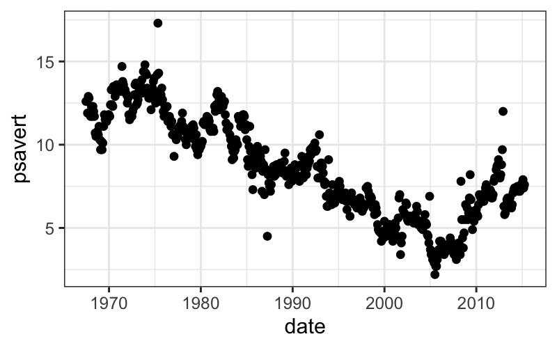

% Stat 470/670 Lecture 8: Flexible modeling for bivariate data
% Julia Fukuyama


## Today

> - Review linear regression/parametric smoothers

> - Nonparametric smoothers

## Regression review

Task 1: How do we use multiple regression to fit non-linear functions of predictors?

Task 2: How can we use weights in regression to do local fits?


## Transformations of the predictor variables: Polynomial regression

One example of multiple regression to fit a non-linear mean, where we use as predictors carat plus the second and third powers of carat.

This gives us the best-fitting third-degree polynomial.


``` r
library(tidyverse)
```

```
## ── Attaching core tidyverse packages ────────────────────────────────────────────────────────────────────────────── tidyverse 2.0.0 ──
## ✔ dplyr     1.1.4     ✔ readr     2.1.5
## ✔ forcats   1.0.0     ✔ stringr   1.5.1
## ✔ lubridate 1.9.4     ✔ tibble    3.2.1
## ✔ purrr     1.0.2     ✔ tidyr     1.3.1
## ── Conflicts ──────────────────────────────────────────────────────────────────────────────────────────────── tidyverse_conflicts() ──
## ✖ dplyr::filter() masks stats::filter()
## ✖ dplyr::lag()    masks stats::lag()
## ℹ Use the conflicted package (<http://conflicted.r-lib.org/>) to force all conflicts to become errors
```

``` r
library(broom)
diamonds = diamonds %>% mutate(log_price = log10(price))
lm.poly = lm(
    log_price ~ carat + I(carat^2) + I(carat^3),
    data = diamonds, subset = clarity == "VS1")
ggplot(augment(lm.poly)) +
    geom_point(aes(x = carat, y = log_price), size = .5, alpha = .2) +
    geom_line(aes(x = carat, y = .fitted), color = "blue")
```


``` r
ggplot(augment(lm.poly)) +
    geom_point(aes(x = carat, y = .resid), size = .5, alpha = .2)
```


``` r
augment(lm.poly) |> 
  mutate(carat_bin = cut(carat, breaks = seq(.3, 2.5, by = .1), right = FALSE)) |>
  group_by(carat_bin) |> 
  summarise(mean(.resid))
```

```
## # A tibble: 23 × 2
##    carat_bin `mean(.resid)`
##    <fct>              <dbl>
##  1 [0.3,0.4)        0.00477
##  2 [0.4,0.5)       -0.0153 
##  3 [0.5,0.6)        0.0324 
##  4 [0.6,0.7)       -0.0258 
##  5 [0.7,0.8)       -0.0131 
##  6 [0.8,0.9)       -0.0463 
##  7 [0.9,1)         -0.0411 
##  8 [1,1.1)          0.0326 
##  9 [1.1,1.2)       -0.00994
## 10 [1.2,1.3)       -0.0279 
## # ℹ 13 more rows
```

## Transformations of the predictor variables: Non-smooth functions of the predictors


Here we augment our initial predictors with several step functions of the predictors:

$$
f_a(x) = \begin{cases}
1 & x \ge a\\
0 & x < a
\end{cases}
$$

. . .


``` r
step = function(x, step_position) {
    return(ifelse(x >= step_position, 1, 0))
}
lm.steps = lm(
    log_price ~
        carat + I(carat^2) + I(carat^3) +
        step(carat, .3) + step(carat, .5) + step(carat, 1) +
        step(carat, 1.5) + step(carat, 2),
    data = diamonds, subset = clarity == "VS1")
ggplot(augment(lm.steps)) +
    geom_point(aes(x = carat, y = log_price), size = .5, alpha = .2) +
    geom_line(aes(x = carat, y = .fitted), color = "red")
```


## Transformations of the predictor variables: Dummy variables for factors

The dummy or indicator function, $\mathbf I_a$ can be used to transform factor variables into numeric predictors:

$$
\mathbf I_a(x) = \begin{cases}
1 & x = a \\
0 & x \ne a
\end{cases}
$$

. . .

This is what R is doing behind the scenes when you use a factor variable in a linear model.

We can inspect the transformation it uses with `model.matrix`:


``` r
head(model.matrix(~ 0 + color, data = diamonds))
```

```
##   colorD colorE colorF colorG colorH colorI colorJ
## 1      0      1      0      0      0      0      0
## 2      0      1      0      0      0      0      0
## 3      0      1      0      0      0      0      0
## 4      0      0      0      0      0      1      0
## 5      0      0      0      0      0      0      1
## 6      0      0      0      0      0      0      1
```

``` r
head(diamonds$color)
```

```
## [1] E E E I J J
## Levels: D < E < F < G < H < I < J
```

``` r
lm(price ~ 0 + color, data = diamonds)
```

```
## 
## Call:
## lm(formula = price ~ 0 + color, data = diamonds)
## 
## Coefficients:
## colorD  colorE  colorF  colorG  colorH  colorI  colorJ  
##   3170    3077    3725    3999    4487    5092    5324
```


## Generalizations of the regression problem: Weighted least squares

If we have more faith in some points than others, or if we simply want to exclude some points, we can perform weighted linear regression.

Let $w_i$, $i = 1,\ldots, n$ be non-negative values.

In weighted regression, we find $\beta_0, \ldots, \beta_p$ to minimize

$$
\sum_{i=1}^n w_i (y_i - (\beta_0 + \beta_1 x_{i1} + \cdots + \beta_p x_{ip}))^2
$$

Or, in matrix notation:
$$
\|\mathbf W^{1/2} (\mathbf y - \mathbf X \mathbf \beta)\|_2^2
$$
where $\mathbf W^{1/2}$ is an $n \times n$ diagonal matrix with $w_i^{1/2}$ as the $i$th diagonal element.

. . .

Properties:

- Setting $w_i = 0$ is equivalent to omitting the $i$th data point from the analysis.

- Setting all of the $w_i$'s equal to $1$, or all the equal to the same positive value, leads to the same coefficient estimates as standard linear regression.

- Heuristically, points with higher values of $w_i$ have higher "weight" in the regression estimation: the line is penalized more for deviating from those points, and so the fitted line will tend to track points with high weights more closely than points with low weights.

## References

If you feel like you need to brush up on this, a good reference is Weisberg, Applied Linear Regression.

> - Section 3.4 of Weisberg describes the matrix notation version of multiple regression.

> - Chapter 6 of Weisberg describes polynomial regression and indicator matrices for factor variables.

## Smoothing

Reading: Cleveland pp. 91-110

Why do we want to smooth?

- If we have a lot of data/noise, the smoother allows us to see what we can't in a scatterplot of the raw data.

- If we want to compare multiple sets of points, the smoother simplifies the description and allows us to make the comparison between the "main effects" in the data without our eye being distracted by the noise.

- Non-EDA: If we want to predict or estimate true underlying values from noisy data, smoothers often help. Remember though, if this is your purpose, you should still do the exploratory analysis to decide what type of smoother to use, whether there should be breaks or jumps in the smoother, or if any other weird things are happening.

## LOESS

LOESS, or local regression, builds on standard regression. The setup is:

> - We have bivariate data, so pairs $(y_i, x_i)$, $i = 1,\ldots, n$.

> - We want to estimate the mean $E(Y \mid X)$. We think this is a smooth function of $X$, but we don't know what the form of that function is.

The idea is that since the mean function is smooth, it can be approximated with a linear or low-order polynomial function in small regions.

## LOESS: details

The way we transform this intuition into a concrete procedure is to use weighted least squares.

LOESS has two parameters, $\alpha$ (the span), and $\lambda$, the degree of the local polynomial.

To find the value of the LOESS smoother at a point $x_0$, we first define weights for all of the samples:
$$
w_i(x_0) = T(\Delta_i(x_0) / \Delta_{(q)}(x_0))
$$
where $\Delta_i(x_0) = |x_i - x_0|$, $\Delta_{(i)}(x_0)$ are the ordered values of $\Delta_{i}(x_0)$, and $q = \alpha n$, rounded to the nearest integer.

$T$ is the tricube weight function (invented by Tukey!):
$$
T(u) = \begin{cases}
(1 - |u|^3)^3 & |u| \le 1 \\
0 & |u| > 1
\end{cases}
$$


----

These weights are then used in a local regression.

If $\lambda = 1$, we find $\hat \beta_0$, $\hat \beta_1$ to minimize the weighted least squares criterion,
$$
(\hat \beta_0, \hat \beta_1) = \text{arg min}_{(\beta_0, \beta_1)} \sum_{i=1}^n w_i (y_i - (\beta_0 + \beta_1 x_i))^2,
$$

and the fitted value for the LOESS smoother at $x_0$ is $\hat \beta_0 + \hat \beta_1 x_0$.

. . .

If $\lambda = 2$, we use quadratic regression, e.g. find $\hat \beta_0$, $\hat \beta_1$, $\hat \beta_2$ to minimize the weighted least squares criterion,
$$
(\hat \beta_0, \hat \beta_1, \hat \beta_2) = \text{arg min}_{(\beta_0, \beta_1, \beta_2)} \sum_{i=1}^n w_i (y_i - (\beta_0 + \beta_1 x_i + \beta_2 x_i^2))^2,
$$

and the fitted value for the LOESS smoother at $x_0$ is $\hat \beta_0 + \hat \beta_1 x_0 + \hat \beta_2 x_0^2$.

. . .

The analogous procedure works for any integer value of $\lambda$.

-----

The procedure described above gives a fitted value of the smoother at one point; and we need to do all the weight and coefficient computations for every point at which we want to evaluate the smoother.

## LOESS in R

We'll look at the `economics` dataset (in ggplot2).

It looks like this:


``` r
economics
```

```
## # A tibble: 574 × 6
##    date         pce    pop psavert uempmed unemploy
##    <date>     <dbl>  <dbl>   <dbl>   <dbl>    <dbl>
##  1 1967-07-01  507. 198712    12.6     4.5     2944
##  2 1967-08-01  510. 198911    12.6     4.7     2945
##  3 1967-09-01  516. 199113    11.9     4.6     2958
##  4 1967-10-01  512. 199311    12.9     4.9     3143
##  5 1967-11-01  517. 199498    12.8     4.7     3066
##  6 1967-12-01  525. 199657    11.8     4.8     3018
##  7 1968-01-01  531. 199808    11.7     5.1     2878
##  8 1968-02-01  534. 199920    12.3     4.5     3001
##  9 1968-03-01  544. 200056    11.7     4.1     2877
## 10 1968-04-01  544  200208    12.3     4.6     2709
## # ℹ 564 more rows
```


-----

Let's look at how `psavert` changes over time using a scatterplot:


``` r
ggplot(economics) + geom_point(aes(x = date, y = psavert))
```




----- 

We'll try smoothing here, but first note two tricky things about this particular example:

- The `loess` function doesn't work well with `date` class predictors, so we need to change date to numeric.

- When we plot the output, we want to plot the original date on the x-axis, but `augment` by default only gives us the variables that were used in the model (`date_numeric` and `psavert`). To get a data frame with all the original variables, we need to pass `augment` the extra argument `data = economics`.

. . .


``` r
economics = economics %>% mutate(date_numeric = as.numeric(date))
l.out = loess(psavert ~ date_numeric, data = economics)
ggplot(augment(l.out, data = economics), aes(x = date, y = .fitted)) +
    geom_point(aes(y = psavert)) + geom_line(color = "red")
```


