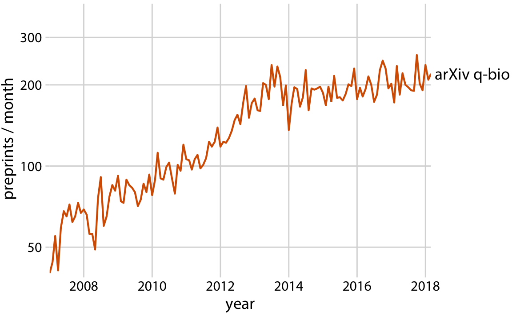

% Graphics
% Julia Fukuyama

```{r setup, echo = FALSE}
library(knitr)
opts_chunk$set(fig.cap="", fig.width = 5, fig.height = 3, dpi=175, fig.path="graphics/", warning = FALSE)
library(ggplot2)
library(magrittr)
library(tidyverse)
## devtools::install_github("clauswilke/colorblindr")
library(colorblindr)
library(GGally)
library(broom)
set.seed(0)
```

## Graphics

> - [Reading](https://clauswilke.com/dataviz/telling-a-story.html)

> - Example of graphs you would make for yourself vs. what you would present

## Telling a story

> - arXiv is a preprint server originally aimed at physicists

> - It started to become popular with biologists (arXiv q-bio), but interest all of a sudden seemed to level off.



------

Why did this happen? Appearance of another preprint server that was more popular:


## Make simple figures/build to complex figures

## Flights Example Take 1

```{r, echo = FALSE}
library(nycflights13)
carrier_names <- data.frame(carrier = c("9E", "AA", "B6", "DL", "EV", "MQ", "UA", "US", "WN", "--"),
                            name= c("Endeavor", "American", "JetBlue", "Delta", "ExpressJet", "Envoy", "United",
                                    "US Airways", "Southwest", "other"))

flights_clean <- filter(flights,
                !dest %in% c("HNL", "ANC") # remove Honolulu and Anchorage because they're so far
                ) %>%
  mutate(carrier = ifelse(carrier %in% c("DL", "AA"), carrier, "--")) %>%
  left_join(carrier_names) %>%
  select(name, distance, arr_delay, dest) %>%
  na.omit()

flights_clean$name <- factor(flights_clean$name, levels = c("American", "Delta", "other"))

delay <- flights_clean %>%
  group_by(name, dest) %>%
  summarise(count = n(),
            distance = mean(distance, na.rm = TRUE),
            arr_delay = mean(arr_delay, na.rm = TRUE))

p_delay_distance <- ggplot(delay, aes(x = distance, y = arr_delay, color = name, fill = name)) +
  geom_point(aes(size = count), alpha = .5, pch = 21) +
  geom_smooth(data = flights_clean, aes(x = distance, y = arr_delay, color = name),
              se = FALSE, inherit.aes = FALSE, size = 0.75,
              method = 'gam', formula = y ~ s(x, bs = "cs", k = 3), show.legend = FALSE) +
  scale_x_continuous(limits = c(0, 3050),
                     expand = c(0, 0),
                     name = "distance (miles)") +
  scale_y_continuous(name = "mean arrival delay (min.)") +
  scale_size(breaks = c(4000, 8000, 12000), name = "# of flights",
             range = c(2, 8)) +
  scale_color_OkabeIto(name = "airline", darken = .2, order = c(2, 7, 1)) +
  scale_fill_OkabeIto(name = "airline", order = c(2, 7, 1)) +
  guides(color = guide_legend(order = 1),
         fill = guide_legend(override.aes = list(size = 4, alpha = .7), order = 1),
         size = guide_legend(override.aes = list(fill = "gray70"), order = 2)) +
    theme(plot.margin = margin(3.5, 14, 3.5, 1.5))
p_delay_distance
```

## Flights Example Take 2

-----


Longer flights have longer average delays for American Airlines....

```{r, echo = FALSE}
p_delay_distance_american <- ggplot(subset(delay, name == "American"),
                           aes(x = distance, y = arr_delay, fill = name)) +
  geom_point(aes(size = count), alpha = .5, pch = 21) +
  geom_smooth(data = subset(flights_clean, name == "American"), aes(x = distance, y = arr_delay, color = name),
              se = FALSE, inherit.aes = FALSE, size = 0.75,
              method = 'gam', formula = y ~ s(x, bs = "cs", k = 3), show.legend = FALSE) +
  scale_x_continuous(limits = c(0, 3050),
                     expand = c(0, 0),
                     name = "distance (miles)") +
  scale_y_continuous(name = "mean arrival delay (min.)") +
  scale_size(breaks = c(4000, 8000, 12000), name = "# of flights",
             range = c(2, 8)) +
  scale_color_OkabeIto(name = "airline", darken = .2, order = 2) +
  scale_fill_OkabeIto(name = "airline", order = 2) +
  guides(color = guide_legend(order = 1),
         fill = guide_legend(override.aes = list(size = 4, alpha = .7), order = 1),
         size = guide_legend(override.aes = list(fill = "gray70"), order = 2)) +
    theme(plot.margin = margin(3.5, 14, 3.5, 1.5))
p_delay_distance_american
```

------

But not for Delta

```{r, echo = FALSE}
p_delay_distance_delta <- ggplot(subset(delay, name == "Delta"),
                           aes(x = distance, y = arr_delay, fill = name)) +
  geom_point(aes(size = count), alpha = .5, pch = 21) +
  geom_smooth(data = subset(flights_clean, name == "Delta"), aes(x = distance, y = arr_delay, color = name),
              se = FALSE, inherit.aes = FALSE, size = 0.75,
              method = 'gam', formula = y ~ s(x, bs = "cs", k = 3), show.legend = FALSE) +
  scale_x_continuous(limits = c(0, 3050),
                     expand = c(0, 0),
                     name = "distance (miles)") +
  scale_y_continuous(name = "mean arrival delay (min.)") +
  scale_size(breaks = c(4000, 8000, 12000), name = "# of flights",
             range = c(2, 8)) +
  scale_color_OkabeIto(name = "airline", darken = .2, order = 7) +
  scale_fill_OkabeIto(name = "airline", order = 7) +
  guides(color = guide_legend(order = 1),
         fill = guide_legend(override.aes = list(size = 4, alpha = .7), order = 1),
         size = guide_legend(override.aes = list(fill = "gray70"), order = 2)) +
    theme(plot.margin = margin(3.5, 14, 3.5, 1.5))
p_delay_distance_delta
```

------

In fact, most airlines have the opposite trend: longer flights tend to be less delayed for Delta and for all the other airlines:
```{r, echo = FALSE}
p_delay_distance
```


## Example: Prostate Cancer

We have a data set containing clinical data on patients who were about
to receive a radical prostatectomy. The relevant variables are:

Variables about sizes:

> - `lcavol`: log cancer volume

> - `lweight`: log prostate weight

> - `lbph`: log of the amount of benign prostatic hyperplasia

Variables about the individual:

> - `age`: Age in years

Variables measured by the pathologist:

> - `svi`: Seminal vesicle invasion, a measure of how advanced the cancer is.

> - `lcp`: log of capsular penetration

> - `gleason`: A numeric vector giving the [Gleason score](https://www.pcf.org/about-prostate-cancer/diagnosis-staging-prostate-cancer/gleason-score-isup-grade/). In theory can range from 2-10, in practice ranges from 6-10.

> - `pgg45`: Percent of cells with Gleason score 4 or 5.

The "response" variable:

> - `lpsa`: log of the concentration of prostate-stimulating antigen.

We are primarily interested in `lpsa`, which is used as a marker for prostate cancer. We would like to know whether and how it is related to the other variables we have available to us.


## First we look at the data

```{r, fig.width = 8, fig.height = 5}
prostate = read.table("prostate.txt")
summary(prostate)
prostate = prostate %>% select(-"train")
ggpairs(prostate, progress = FALSE)
```

From the `ggpairs` plot, we see that the distributions of the
variables are reasonably symmetrical, not that skewed, and that there
is at least some relationship between most of the variables and `lpsa`.


## Linear model with all the predictors

As a first step, we can fit a linear model with all the predictors and
look at the results. We see that a lot of the coefficients are within
the margin of error of zero, which suggests to us that a model with
fewer predictors would do better.

```{r}
prostate_lm = lm(lpsa ~ ., data = prostate)
prostate_coefs = tidy(prostate_lm, conf.int = TRUE)
ggplot(prostate_coefs[-1, ], aes(x = estimate, y = term, xmin = conf.low, xmax = conf.high)) +
    geom_point() + geom_errorbarh() + geom_vline(xintercept = 0)
```


## What do automatic methods for variable selection tell us about which predictors should be included?

```{r}
library(leaps)
prostate_best_subset = regsubsets(lpsa ~ ., data = prostate)
summary(prostate_best_subset)$which
```

This shows us that the best one-predictor model uses `lcavol`, the
best two-predictor model uses `lcavol` and `lweight`, the best
three-predictor model uses `lcavol`, `lweight`, and `svi`, and so on.

We can use this set of models as guidance for what variables to
include, and build up an interpretable model using some of the tools
we've seen earlier in the course.

-----

`regsubsets` also does forward and backward stepwise regression. In this case they all give the same results.

```{r}
prostate_forward = regsubsets(lpsa ~ ., data = prostate, method = "forward")
summary(prostate_forward)$which

prostate_backward = regsubsets(lpsa ~ ., data = prostate, method = "backward")
summary(prostate_backward)$which

all(summary(prostate_backward)$which == summary(prostate_forward)$which)
all(summary(prostate_backward)$which == summary(prostate_best_subset)$which)
```


-----

We start off looking at the best one-predictor model, with `lcavol`
predicting `lpsa`.

```{r}
ggplot(prostate, aes(x = lcavol, y = lpsa)) + geom_point() + geom_smooth()
```

We see that the relationship is pretty close to linear (a line would
go through the entire confidence band of the smoother), and so we're
ok with using a linear function of `lcavol` to predict `lpsa`.

If there had been a major non-linearity here, we would have wanted to
ditch the linear modeling approach and do something non-parametric,
maybe loess.

-----

Then we can move to the two-predictor model, and see what the
relationship between `lcavol`, `lweight`, and `lpsa` looks like.

We can make a coplot to examine the relationship between `lpsa` and
`lcavol`, with `lweight`as the given variable

```{r}
ggplot(prostate, aes(x = lcavol, y = lpsa)) + geom_point() + geom_smooth(span = 1) + 
    facet_grid(~cut_number(lweight, n = 3))
```

Here it seems like there is some non-linearity, but only for the
observations with a high value of `lweight`.

If we had a lot more observations, this might prompt us to move to
loess, but since the non-linearity is based on just a few points, we
want to see first whether the non-linearity shows up in other graphs
as well.

-----

The best three-predictor model identified by `leaps` included `svi` in
addition to `lcavol` and `lweight`, so we next look at those four
variables together.

`svi` is binary and there are only 21 cases where `svi` is equal to 1,
we can't make a lot of facets and we don't trust curves that much.

```{r}
table(prostate$svi)
prostate$svi = recode(prostate$svi, `1` = "Yes", `0` = "No")
ggplot(prostate, aes(x = lcavol, y = lpsa, group = svi, color = svi)) +
    geom_point() + 
    geom_smooth(method = "lm", se = FALSE) + facet_wrap(~ cut_number(lweight, n = 2))
```

The different slopes suggest an interaction, but again, we don't have
that much data.

-----

Next we try looking at the predictors from the four-predictor
model. This is pushing the limits of the number of variables we can
look at all at once, but we will try.

We can look at the relationship between `lpsa`, `lcavol`, and `svi`,
with `lweight` and `lbph` as the given variables.

```{r}
ggplot(prostate, aes(x = lcavol, y = lpsa, group = svi, color = svi)) +
    geom_point() + 
    geom_smooth(method = "lm", se = FALSE) +
        facet_grid(cut_number(lweight, n = 2) ~ cut(lbph, breaks = c(-2, -1, 3)))
```

Based on this visualization, we might not be confident about an interaction: the blue lines vary in slope, but there’s based on very small samples. The red lines have different heights but are similar in slope.

-----

We’re not always required to find a "best" model, and even if we were we can decide on what best means subjectively.

If you wanted to fit a linear model with `lcavol`, `lweight`, and `svi` as predictors plus interactions, you’re free to do so and then call that "best" because of the complexity you can get out of a relatively small number of variables.

We can also check what the model selection criteria tell us about how many variables to use:

```{r}
cp_df = data.frame(value  = summary(prostate_best_subset)$cp,
                   n_params = seq_along(summary(prostate_best_subset)$cp),
                   type = "Cp")
bic_df = data.frame(value = summary(prostate_best_subset)$bic,
                    n_params = seq_along(summary(prostate_best_subset)$bic),
                    type = "BIC")
model_selection_criterion_df = rbind(cp_df, bic_df)
ggplot(model_selection_criterion_df, aes(x = n_params, y = value)) +
    geom_point() + facet_wrap(~ type, scales = "free_y")
```

Even though the lowest value of Cp is for 5 predictors, the Cp value for 3 predictors is very close to the value for 5 predictors and BIC has a strong minimum at 5 predictors. The two plots suggest that if we don't believe we need any interactions, we should use a model with an intercept and two predictors.

## Plotting a final model


```{r, echo = FALSE}
lm_final = lm(lpsa ~ lcavol + lweight + svi, data = prostate)
final_fits = augment(lm_final)

## get the bins and the bin means
prostate_with_lweight_bins = prostate %>%
    mutate(lweight_bins = cut_number(lweight, n = 3),
           lweight_bins_labeled = cut_number(lweight, n = 3, labels = c("low cancer weight", "medium cancer weight", "high cancer weight")),
           lcavol_bins = cut_number(lcavol, n = 3, labels = c("low cancer volume", "medium cancer volume", "high cancer volume"))) %>%
    separate(lweight_bins, into = c(NA, "lo", "hi", NA), remove = FALSE, sep = "\\[|\\(|\\)|\\]|,") %>%
    mutate(bin_mean = (as.numeric(lo) + as.numeric(hi)) / 2)

## get the grid for prediction
prostate_grid_final = expand.grid(lweight = unique(prostate_with_lweight_bins$bin_mean),
                                  lcavol = quantile(prostate$lcavol),
                                  svi = c("Yes", "No")) %>% data.frame()
## predictions on the grid
prostate_fits_on_grid = augment(lm_final, newdata = prostate_grid_final)
## add information about the bins to the fits
prostate_fits_on_grid = merge(prostate_fits_on_grid,
                             unique(prostate_with_lweight_bins[,c("lweight_bins", "lweight_bins_labeled", "bin_mean")]),
                             by.x = "lweight", by.y = "bin_mean")
## subset so we don't plot the fits outside the range of the data
prostate_fits_on_grid = prostate_fits_on_grid %>% subset(!(svi == "Yes" & lcavol < 1))
ggplot(prostate_with_lweight_bins, aes(x = lcavol, y = lpsa, color = svi)) +
    geom_point() +
    geom_line(aes(y = .fitted), data = prostate_fits_on_grid) +
    facet_wrap(~ lweight_bins) +
    scale_x_continuous("Log Cancer Volume") + scale_y_continuous("Log PSA") +
    scale_color_discrete("SVI") +
    ggtitle("Log PSA as a function of log cancer volume,\nfaceted by log weight")
```

## Another try, not all the information in one plot

This set of images is more "for the postdoc" and less "for the generals," but sometimes they are your audience too.

Cancer volume is the most important determinant of PSA:

```{r}
ggplot(prostate, aes(x = lcavol, y = lpsa)) + geom_point() +
    scale_x_continuous("Log cancer volume") + scale_y_continuous("Log PSA")
```

------

Cancer weight is not as important on its own, but cancer weight is also important even when we take into account cancer volumes, particularly for low cancer volumes:
```{r, fig.width = 6.5}
ggplot(prostate_with_lweight_bins, aes(x = lweight, y = lpsa, color = lcavol_bins)) +
    geom_point() + facet_wrap(~ lcavol_bins, scales = "free_x") +
    scale_color_discrete("Cancer volume") +
    scale_x_continuous("Log cancer weight") + scale_y_continuous("Log PSA")
```

------

There is a suggestion that SVI has an effect on PSA as well, even taking into account cancer weight and volume, but even though we get a positive term in the linear model the effect is less consistent and convincing.
```{r, fig.width = 6}
ggplot(prostate_with_lweight_bins, aes(x = lcavol, y = lpsa, color = svi)) +
    geom_point() +
    facet_wrap(~ lweight_bins_labeled) +
    geom_line(aes(x = lcavol, color = svi, y = .fitted),
              data = prostate_fits_on_grid) +
    scale_color_discrete("SVI") +
    scale_x_continuous("Log cancer volume") + scale_y_continuous("Log PSA")
```

## Summing up

> - Think about the story you are trying to tell

> - Tailor to your audience

> - If you need to show a complex figure, it helps to build up to it with simpler versions
