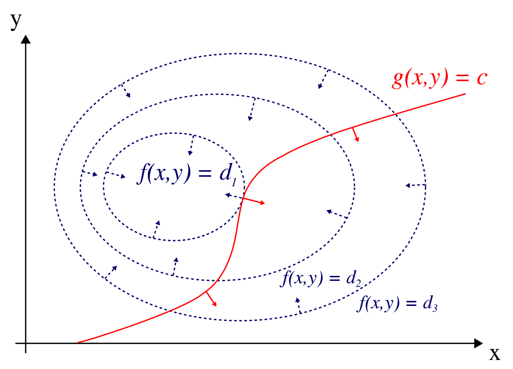

## Methods for constrained optimization problems

```{r setup, echo = FALSE, message = FALSE}
library(knitr)
opts_chunk$set(fig.cap="",
               fig.path="lecture-19-fig/", warning = FALSE)
```


Agenda for the week

- Today: methods for constrained optimization problems

- Thursday: applications


## The problem we want to solve

$$
\begin{align*}
\text{minimize}_x \quad &f(x)\\
\text{subject to} \quad &f_1(x) = c
\end{align*}
$$

## For example

We roll a 6-sided die $n$ times. It comes up 1 $n_1$ times, 2 $n_2$ times, and so on up to $n_6$.

We don't necessarily trust it to be fair, and so we want maximum likelihood estimates of the chance of rolling $1, \ldots, 6$.

. . .

We write down the likelihood:
$$
L(p_1, \ldots, p_6) = \frac{n!}{\prod_{i=1}^6 n_i!} \prod_{i=1}^6 p_i^{n_i}
$$

And the log likelihood
$$
\ell(p_1, \ldots, p_6) = \log \frac{n!}{\prod_{i=1}^6 n_i!} + \sum_{i=1}^6 n_i \log p_i
$$

. . .

Optimize by taking the derivative and setting to zero?
$$
\frac{\partial \ell}{\partial p_1} = \frac{n_1}{\theta_1} = 0
$$

-----

This is actually a constrained optimization problem, we don't just maximize the likelihood, we maximize subject to the constraint $\sum_{i=1}^6 p_i = 1$.

Our problem really should be
$$
\begin{align*}
\text{maximuze} \quad &\ell(p_1, \ldots, p_6)\\
\text{subject to} \quad &\sum_{i=1}^n  p_i= 1
\end{align*}
$$


## Lagrange multipliers

Suppose we want to minimize $f(x)$ subject to the constraint $f_1(x) = c$ (equivalently, $f_1(x) - c = 0$).

We can form the _Lagrangian_:

$$
\mathcal L(x, \lambda) = f(x) - \lambda (f_1(x) - c)
$$

If we minimize $\mathcal L$ over $x$ and $\lambda$, the optimal value $x^*$ will be the same as the optimal value for the constrained problem.


. . .

Why?

$$
\begin{align*}
\nabla_x \mathcal L |_{x^*, \lambda^*} &= \nabla f(x^*) - \lambda^* \nabla f_1(x^*) = 0 \\
\frac{\partial \mathcal L}{\partial \lambda}|_{x^*, \lambda^*} &= f_1(x^*) - c = 0
\end{align*}
$$

- Second line tells us that $f_1(x^*) - c = 0$ at the optimal point.

. . .

- First line tells us that at the optimal point, the gradients of the objective function ($f$) and the constraint function ($f_1$) will be parallel.

- Interpretation: At a point where gradients are not parallel, a tiny step along $f_1$ in one direction will lead to an increase in the value of $f$, and a tiny step in the other direction will lead to a decrease in the value of $f$. Therefore, that point can't be optimal. 




## Lagrange multipliers for multinomial likelihood

Lagrangian for the constrained maximum likelihood problem:

$$
\mathcal L(p_1, \ldots, p_6, \lambda) = \log \frac{n!}{\prod_{i=1}^6 n_i!} + \sum_{i=1}^6 n_i \log (p_i) - \lambda (\sum_{i=1}^6 p_i - 1)
$$

. . .

Derivatives with respect to $p_i$:
$$
\frac{\partial \mathcal L}{\partial p_i}|_{p_i^*, \lambda^*} = \frac{n_i}{p_i^*} - \lambda^* = 0
$$
Rearranging tells us that $\frac{n_i}{ \lambda^*} = p_i^*$

. . .

Derivative with respect to $\lambda$:
$$
\frac{\partial \mathcal L}{\partial \lambda}|_{p_i^*, \lambda^*} = \sum_{i=1}^6 p_i - 1 = 0
$$

. . .

A bit more manipulation:
$$
\sum_{i=1}^6 \frac{n_i}{\lambda^*} = \sum_{i=1}^6 p_i^* = 1
$$
so $\lambda^* = \sum_{i=1}^6 n_i = n$, and $p_i^* = \frac{n_i}{\sum_{i=1}^6 n_i}$


## Notes

- Useful because it makes equality-constrained problems into unconstrained problems, and we have a lot of ways of solving unconstrained problems

- From the material on convex problems, we know that equality constraints are only likely to maintain the convexity of the problem if the equality constraints are linear/affine

- But the theory goes through for non-linear equality constraints: if you can solve analytically you will get the right solution, and if you apply some of the descent methods we used for unconstrained problems to a non-convex problem you can still get a result

- Can deal with multiple equality constraints by having multiple Lagrange multipliers.


## Inequality constraints

Suppose we want to minimize $f(x)$ subject to the constraint $f_1(x) \le c$ (equivalently, $f_1(x) - c \le 0$).

We could change it to an unconstrained problem by defining the following function:
$$
I(x) = \begin{cases}
\infty & f_1(x) - c > 0 \\
0 & f_1(x) - c \le 0
\end{cases}
$$

Then
$$
\text{minimize } f(x) \quad \text{subject to } f_1(x) - c \le 0
$$
is equivalent to
$$
\text{minimize } f(x) + I(x)
$$

----

Problem: The $I(x)$ function doesn't play well with the methods we have for unconstrained optimization.

Solution: Make a nice (i.e. differentiable) approximation of $I(x)$.

. . .

The log-barrier function is our differentiable approximation:
$$
\hat I_\mu(x) = \begin{cases}
- \mu \log(c - f_1(x)) & f_1(x) - c \le 0\\
\infty & f_1(x) - c > 0
\end{cases}
$$

As $\mu$ gets closer to 0, $\hat I_\mu$ is a better approximation to $I$.

-----

For example: if we want to enforce $x < 0$ ($f_1(x) = x, c = 0$), the log-barrier function would be $-\mu \log(-x)$
```{r}
x = seq(-2,0, length.out = 10000)[-10000]
plot(-2 * log(-x) ~ x, type = 'l', ylim = c(-3, 10), ylab = "log barrier for x < 0", lty = 1)
points(-1 * log(-x) ~ x, type = 'l', lty = 2)
points(-.5 * log(-x) ~ x, type = 'l', lty = 3)
```

## Interior Point algorithm

Problem:
$$
\begin{align*}
\text{minimize } &f(x) \\
\text{subject to } & f_i(x) \le c_i, \quad i = 1,\ldots, m
\end{align*}
$$

Start with a point $x$ in the feasible set, initial $\mu$

Repeat

- Minimize $f(x) + \sum_{i=1}^m - \mu \log(c_i - f_i(x))$.

- Reduce $\mu$.

Until the stopping criterion is reached.

## Example: dice again

Suppose we think that our dice are biased in a certain way: $\sum_{i=1}^3 p_i \ge .6$, and we also don't think any given $p_i$ is too small: $p_i \ge .01$, $i = 1,\ldots, 6$.

We can write the maximum likelihood problem subject to this constraint as

$$
\begin{align*}
\text{maximize} \quad & \ell(p_1, \ldots, p_n)\\
\text{subject to} \quad& \sum_{i=1}^6 p_i = 1\\
& \sum_{i=1}^3 p_i \ge .6\\
& p_i \ge .01, \quad i = 1,\ldots, 6
\end{align*}
$$

We can incorporate the equality constraints as Lagrange multipliers:
$$
\begin{align*}
\text{maximize} \quad & \mathcal L(p_1, \ldots, p_n, \lambda)\\
\text{subject to} \quad&  \sum_{i=1}^3 p_i \ge .6\\
& p_i \ge .01, \quad i = 1,\ldots, 6
\end{align*}
$$
and try to use the barrier method to get the maximum likelihood estimate for the inequality-constrained problem.

-----

Define a function for the Lagrangian:
```{r}
lagrangian = function(p_and_lambda, nvec) {
    p = p_and_lambda[1:6]
    lambda = p_and_lambda[7]
    if(any(p <= 0)){
        return(-Inf)
    }
    L = sum(nvec * log(p)) - lambda  * (sum(p) - 1)
    return(L)
}
logbarrier = function(p, mu) {
    if(sum(p[1:3]) >= .6 && all(p >= .01)) {
        return(-mu * log (-.6 + sum(p[1:3])) - mu * sum(log(-.01 + p)))
    }
    return(Inf)
}
neg_lagrangian_and_logbarrier = function(p_and_lambda, mu, nvec) {
    p = p_and_lambda[1:6]
    -lagrangian(p_and_lambda = p_and_lambda, nvec = nvec) -logbarrier(p = p, mu = mu)
}
```

-----

```{r}
nvec = c(50,10,10,10,10,20)
nvec / sum(nvec)
starting_p_and_lambda = c(nvec / sum(nvec),100)
mu = .25
## check that the starting values are valid
logbarrier(starting_p_and_lambda, mu = mu)
## optimize
o = optim(starting_p_and_lambda,
    neg_lagrangian_and_logbarrier,
    mu = mu, nvec = nvec, method = "SANN")
round(o$par[1:6], digits = 3)
sum(o$par[1:6])
sum(o$par[1:3])
```

-----

Try again with a different set of data values

```{r}
nvec = c(35,10,10,10,10,20)
nvec / sum(nvec)
current_p_and_lambda = c(.5, .1, .1, .1, .1, .1,100)
mu = 1
alpha = .5
logbarrier(starting_p_and_lambda, mu = mu)
o = optim(current_p_and_lambda,
    neg_lagrangian_and_logbarrier,
    mu = mu, nvec = nvec, method = "Nelder-Mead")
cat(round(o$par[1:6], digits = 3), "\n")
cat(sum(o$par[1:6]), "\n")
cat(sum(o$par[1:3]), "\n")
```

## Summing up

- Lagrange multipliers to make equality-constrained problems into unconstrained problems.

- Interior point methods solve the inequality-constrained problem by approximating a hard barrier with a soft one.

- Idea overall is to change constrained problems into unconstrained ones, and then solve either the unconstrained problem or an approximation.

