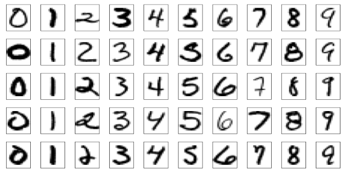

## Neural nets/Deep learning

```{r setup, echo = FALSE, message = FALSE}
library(knitr)
opts_chunk$set(fig.cap="",
               fig.path="lecture-28-fig/",
               fig.width=6, fig.height=7, dpi=70,
               warning = FALSE)
set.seed(1)
```

Agenda today:

- More nets

- Please evaluate the class

Reading: Elements of Statistical Learning, Chapter 11.3-11.8


## Example: zip code data



Goal: Given images representing digits, classify them correctly.

Input data, $x_i$, are $16 \times 16$ grayscale images, represented as vectors in $\mathbb R^{256}$

Responses $y_i$ give the digit in the image.

Encode this as a classification problem, use neural nets with different architectures to fit

-----

## Some net architectures


All cases: 10 output units, corresponding to the 10 possible digits. In all cases the output unit is sigmoidal.

- Net 1: No hidden layer, equivalent to multinomial logistic regression

- Net 2: One hidden layer, 12 hidden units. Each of the hidden units is connected to each of the 256 input variables and to each of the 10 output variables.

- Net 3: Two hidden layers

    - First hidden layer: 64 hidden units arranged in an 8 x 8 grid. Each hidden unit is connected to a 3x3 patch of the input variables.

    - Secand hidden layer: 16 hidden units arranged in a 4 x 4 grid. Each hidden unit is connected to a 5 x 5 patch in the first hidden layer.

- Net 4: Two hidden layers with weight sharing in the first layer.

    - First hidden layer: 128 hidden units, conceptualized as two 8 x 8 grids, each connected to a 3x3 patch of the input variables, similar to Net 3. Additional constraint that each of the units within the 8 x 8 feature map have the same set of 9 weights.

    - Second hidden layer: 16 hidden units arranged in a 4 x 4 grid, each connected to a 5 x 5 patch in each of the two 8 x 8 grids in the first hidden layer (so each hidden unit connected to 50 units in the first hidden layer).

- Net 5: Two hidden layers with weight sharing in both layers:

    - First hidden layer: Same is in Net 4.

    - Second hidden layer: 64 hidden units arranged as four 4 x 4 grids. Each unit connected to a 5 x 5 patch of the fisrt hidden layer, and within each 4 x 4 grid, the weights connecting that unit to the previous input unit are the same.


Idea behind weight constraints: Each unit computes the same functional of the previous layer, so they are extracting the same features from different parts of the image. A net with this sort of weight sharing is referred to as a _convolutional_ network.

-----


## If you want to play with this in R

- R package called [keras](https://keras.rstudio.com/)

- This is an interface to the python version of [keras](https://keras.io/)

- Which is itself a frontend for a couple of lower-level packages (TensorFlow, CNTK, Theano)

-----

Example: the same zip code data

```{r}
## if you want to do this you'll have to install some the python version of keras first, which requires you to have TensorFlow, CNTK, or Theano installed as well
library(keras)
mnist = dataset_mnist()
x_train = mnist$train$x
y_train = mnist$train$y
y_train_matrix = to_categorical(y_train, num_classes = 10)
x_test = mnist$test$x
y_test = mnist$test$y
```

-----

Let's look at some of the images:

```{r}
## function to rearrange things so that we can plot them
flip_image = function(x) {
    n = nrow(x)
    return(t(x[n:1,]))
}
par(mfrow = c(3,3))
for(i in 1:9) {
    image(flip_image(x_train[i,,]), col = topo.colors(100), axes = FALSE,
          main = y_train[i])
}

```

-----

```{r}
model = keras_model_sequential()
model %>%
  layer_flatten(input_shape = c(28, 28)) %>%
  layer_dense(units = 128, activation = 'relu') %>%
  layer_dense(units = 10, activation = 'softmax')
model %>% compile(
    optimizer = 'adam', 
    loss = loss_categorical_crossentropy,
    metrics = 'accuracy'
)
model
## number of parameters for the first layer: each hidden unit has a weight associated with each of the 784 predictor units, plus a bias term
(784 + 1) * 128
## number of parameters for the second layer: each output unit has a weight associated with each of the 128 hidden units, plus a bias term
(128 + 1)* 10
```

-----

Fit the model, look at the predictions:

```{r}
model %>% fit(x = x_train, y = y_train_matrix, epochs = 15)
test_predictions = model %>% predict_classes(x_test)
par(mfrow = c(3,3))
for(i in 1:9) {
    image(flip_image(x_test[i,,]), col = topo.colors(100), axes = FALSE,
          main = sprintf("True digit: %i, Prediction: %i", y_test[i], test_predictions[i]))
}
```

More elaborate architectures do much better, for example the [convolutional model](https://keras.rstudio.com/articles/examples/mnist_cnn.html).

## Summing up


- Deep learning = neural nets with more than one hidden layer. In practice, these work better than the single-hidden-layer networks.

- Think of as predictors that can fit complex functions of the input variables

- Also able to handle other kinds of output, e.g. sequences (natural language processing, machine translation)

- Good when you have a lot of data, are interested solely in prediction

- Not as good when you don't have so much data or need an interpretation of the relationship between the predictors and response.

- No measure of uncertainty: the models look like regression models, but standard nets don't give measures of predictive accuracy.

- There are ways of using them to model uncertainty: e.g. have a net try to predict a posterior distribution instead of a response.
